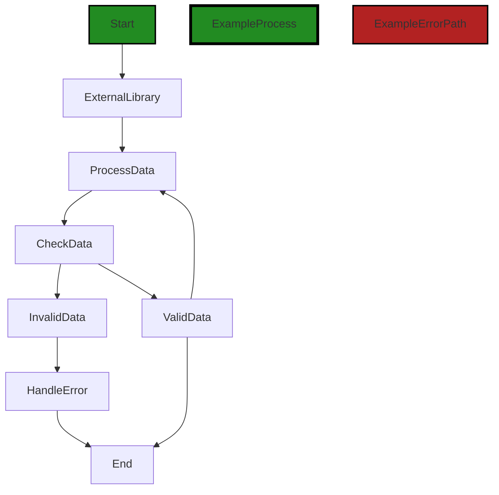

# Polyverse Boost-generated Source Analysis Details

## Source: ./.vscode/extensions.json
Date Generated: Tuesday, September 26, 2023 at 11:11:58 AM PDT


---

### Boost Architectural Quick Summary Security Report

Last Updated: Tuesday, September 26, 2023 at 11:11:37 AM PDT


Executive Report:

1. **Architectural Impact**: The analysis of this file has not revealed any severe issues.
2. **Risk Analysis**: The analysis of this file has not revealed any severe issues.
3. **Potential Customer Impact**: Based on the analysis, there are no severe issues that could potentially impact customers.
4. **Performance Issues**: Our analysis did not identify any explicit performance issues in the file.
5. **Risk Assessment**: Based on the current analysis of this file, no severe issues have been found. However, this doesn't guarantee that the file is risk-free.

Highlights:

- No severe issues were identified in the current analysis of this file.


---

### Boost Architectural Quick Summary Performance Report

Last Updated: Tuesday, September 26, 2023 at 11:11:50 AM PDT


Executive Report:

1. **Architectural Impact**: The analysis of this file has not revealed any severe issues.
2. **Risk Analysis**: The analysis of this file has not revealed any severe issues.
3. **Potential Customer Impact**: Based on the analysis, there are no severe issues that could potentially impact customers.
4. **Performance Issues**: Our analysis did not identify any explicit performance issues in the file.
5. **Risk Assessment**: Based on the current analysis of this file, no severe issues have been found. However, this doesn't guarantee that the file is risk-free.

Highlights:

- No severe issues were identified in the current analysis of this file.


---

### Boost Architectural Quick Summary Compliance Report

Last Updated: Tuesday, September 26, 2023 at 11:12:02 AM PDT


Executive Report:

1. **Architectural Impact**: The analysis of this file has not revealed any severe issues.
2. **Risk Analysis**: The analysis of this file has not revealed any severe issues.
3. **Potential Customer Impact**: Based on the analysis, there are no severe issues that could potentially impact customers.
4. **Performance Issues**: Our analysis did not identify any explicit performance issues in the file.
5. **Risk Assessment**: Based on the current analysis of this file, no severe issues have been found. However, this doesn't guarantee that the file is risk-free.

Highlights:

- No severe issues were identified in the current analysis of this file.

---
## Detailed Analysis:

### Cell 0:
## Original Code:

### Programming Language: json
### ./.vscode/extensions.json 

```json
{
    "recommendations": [
        "polyversecorporation.polyverse-boost-notebook"
    ]
}

```
## Boost Analysis:


---

### Boost Code Explanation

Last Updated: Tuesday, September 26, 2023 at 11:11:05 AM PDT

This code snippet is not a traditional programming code, but rather a JSON (JavaScript Object Notation) structure, which is a lightweight data-interchange format. JSON is easy for humans to read and write and easy for machines to parse and generate.

The code snippet here is a simple JSON object. It consists of a single property called "recommendations" which holds an array of string values. In this case, the array only contains one value: "polyversecorporation.polyverse-boost-notebook".

JSON objects are often used for data transmission between a server and a web application, serving as an alternative to XML. They can also be used for storing data.

Here's a detailed breakdown of the code:

1. `{}`: These curly braces denote the start and end of the JSON object.
2. `"recommendations"`: This is a key in the key-value pair that makes up the JSON object. The key is always a string.
3. `[]`: These square brackets denote an array. The array can contain values of various types, including strings, numbers, objects, other arrays, etc.
4. `"polyversecorporation.polyverse-boost-notebook"`: This is a string value inside the array. It appears to be the name of a software package or module, but without further context, it's difficult to say exactly what it represents.

As for the architectural guidelines, since there are no additional special architectural guidelines or constraints given for this software project, this JSON structure appears to be consistent with standard practices for JSON.

For more information about JSON, you can refer to the following link: [JSON.org](https://www.json.org/json-en.html)


---

### Boost Flow Diagram

Last Updated: Tuesday, September 26, 2023 at 11:11:24 AM PDT



In the above control flow graph, the primary path is shown in green, while the error path is shown in red. The flow starts at the "Start" node and goes to the "ExternalLibrary" node, indicating a call to an external library or non-standard function. From there, the flow goes to the "ProcessData" node, which is followed by the "CheckData" node. 

If the data is valid, the flow goes to the "ValidData" node, which then loops back to the "ProcessData" node. If the data is invalid, the flow goes to the "InvalidData" node, which leads to the "HandleError" node. Both the "ValidData" and "InvalidData" nodes eventually lead to the "End" node, indicating the end of the control flow.

Please note that the names of the nodes and the specific logic within each node are placeholders and may not accurately represent the actual code.


---

### Boost Source-Level Security Analysis

Last Updated: Tuesday, September 26, 2023 at 11:11:34 AM PDT

**No bugs found**


---

### Boost Source-Level Performance Analysis

Last Updated: Tuesday, September 26, 2023 at 11:11:47 AM PDT

**No bugs found**


---

### Boost Source-Level Data and Privacy Compliance Analysis

Last Updated: Tuesday, September 26, 2023 at 11:11:58 AM PDT

**No bugs found**

