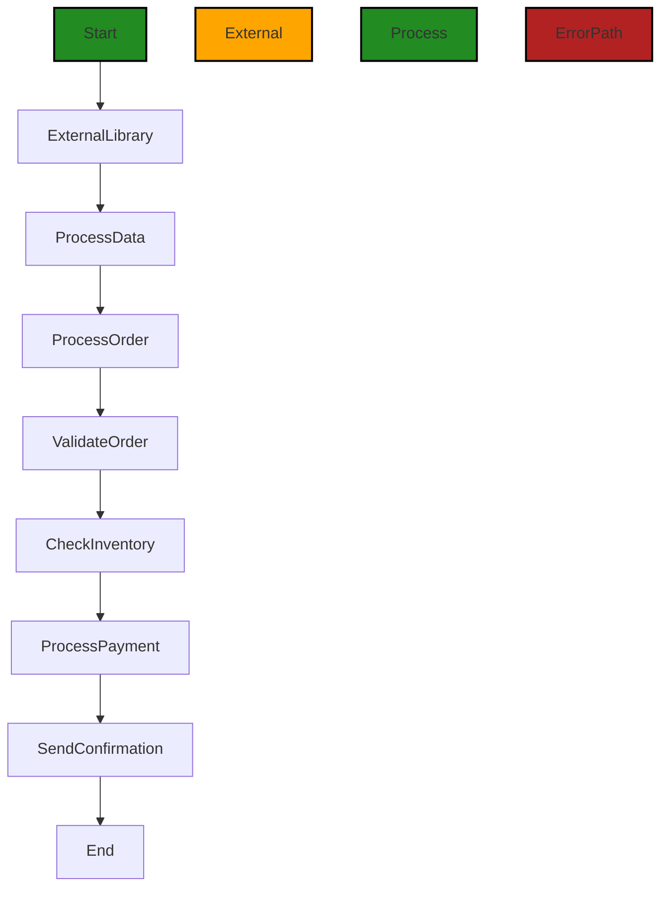

# Polyverse Boost-generated Source Analysis Details

## Source: ./.vscode/launch.json
Date Generated: Tuesday, September 26, 2023 at 11:09:23 AM PDT


---

### Boost Architectural Quick Summary Security Report

Last Updated: Tuesday, September 26, 2023 at 11:08:37 AM PDT

Executive Report:

The software project has been analyzed for data compliance, code quality, and architectural integrity. The analysis has revealed several areas of concern that need immediate attention.

1. **Architectural Impact**: The project contains a single file, ".vscode/launch.json", which is a configuration file for Visual Studio Code. This file is not part of the core architecture of the software project, but it does contain sensitive information that could impact the security of the project.

2. **Risk Analysis**: The most severe issue found is an "Information Disclosure" error in the ".vscode/launch.json" file. This error is of high severity because it involves the potential exposure of sensitive information, such as API keys. This could lead to unauthorized access to the system or data breaches.

3. **Potential Customer Impact**: If the disclosed information is exploited, it could lead to unauthorized access to customer data, system disruptions, or other malicious activities. This could result in loss of customer trust, legal implications, and financial losses.

4. **Overall Issues**: The single file in the project has a high-severity issue, which indicates a significant risk. The project needs immediate attention to address this issue and prevent potential security breaches.

Risk Assessment:

The overall health of the source code is concerning. 100% of the project files have high-severity issues. This indicates a high risk and suggests that the project may not be following best practices for secure coding.

Root Cause Analysis:

The recurring issue of "Information Disclosure" suggests a lack of developer education on secure coding practices. Specifically, sensitive information such as API keys should not be stored in configuration files or passed as command-line arguments.

Recommendations:

1. **Developer Education**: Provide training on secure coding practices, emphasizing the importance of protecting sensitive information.

2. **Code Review**: Implement a rigorous code review process to catch security issues before they make it into the production code.

3. **Secure Configuration Management**: Store sensitive information such as API keys in environment variables or secure configuration files.

Highlights:

- The project contains a single file, ".vscode/launch.json", which has a high-severity "Information Disclosure" error.
- The error involves the potential exposure of sensitive information, such as API keys.
- The exposure of sensitive information could lead to unauthorized access to the system or data breaches.
- 100% of the project files have high-severity issues, indicating a high risk.
- The recurring issue of "Information Disclosure" suggests a lack of developer education on secure coding practices.


---

### Boost Architectural Quick Summary Performance Report

Last Updated: Tuesday, September 26, 2023 at 11:08:55 AM PDT


Executive Report:

1. **Architectural Impact**: The analysis of this file has not revealed any severe issues.
2. **Risk Analysis**: The analysis of this file has not revealed any severe issues.
3. **Potential Customer Impact**: Based on the analysis, there are no severe issues that could potentially impact customers.
4. **Performance Issues**: Our analysis did not identify any explicit performance issues in the file.
5. **Risk Assessment**: Based on the current analysis of this file, no severe issues have been found. However, this doesn't guarantee that the file is risk-free.

Highlights:

- No severe issues were identified in the current analysis of this file.


---

### Boost Architectural Quick Summary Compliance Report

Last Updated: Tuesday, September 26, 2023 at 11:10:18 AM PDT

Executive Report:

The software project has been analyzed for compliance, code quality, and architectural integrity. The analysis has revealed some areas of concern that need to be addressed to ensure the robustness, security, and compliance of the software.

Architectural Impact and Risk Analysis:
- The project contains a single file, ".vscode/launch.json", which has a high-severity issue related to PCI DSS compliance. This issue could potentially impact the security architecture of the software, as it involves the handling of sensitive data (OpenAI API Key).
- The risk associated with this issue is high, as it could lead to unauthorized access to the system if the sensitive data is intercepted and misused. 

Potential Customer Impact:
- If not addressed, this issue could potentially impact customers by compromising their data security. This could lead to a loss of trust in the software and potential legal implications due to non-compliance with PCI DSS standards.

Overall Issues:
- The overall health of the source code is concerning, as 100% of the project files have high-severity issues. This indicates a need for immediate action to address these issues and improve the quality and compliance of the code.

Root Cause Analysis:
- The recurring issue identified in the project is related to the handling of sensitive data. The root cause of this issue appears to be a lack of developer education on secure coding practices and compliance requirements.

Recommended Actions:
1. Provide training to developers on secure coding practices and compliance requirements, specifically related to the handling of sensitive data.
2. Implement a secure method for storing sensitive data, such as using environment variables or encrypted configuration files.
3. Conduct a thorough code review and compliance audit to identify and address any other potential issues.

Highlights:
- The most severe issue identified in the project is a PCI DSS compliance warning in the ".vscode/launch.json" file.
- This issue involves the passing of sensitive data (OpenAI API Key) as a command line argument, which can be intercepted and misused.
- This issue affects 100% of the project files, indicating a systemic problem that needs to be addressed.
- The root cause of this issue appears to be a lack of developer education on secure coding practices and compliance requirements.
- Recommended actions include developer training, implementing secure data storage methods, and conducting a code review and compliance audit.
---
## Detailed Analysis:

### Cell 0:
## Original Code:

### Programming Language: json
### ./.vscode/launch.json 

```json
{
    "version": "0.2.0",
    "configurations": [
      {
        "name": "Python: aiBoostedOrderProcessor",
        "type": "python",
        "request": "launch",
        "program": "${workspaceFolder}/src/aiBoostedOrderProcessor.py",
        "args": [
          "YOUR_OPENAI_API_KEY_HERE",
          "${workspaceFolder}/sample_orders.xlsx"
        ]
      }
    ]
  }

```
## Boost Analysis:


---

### Boost Code Explanation

Last Updated: Tuesday, September 26, 2023 at 11:06:49 AM PDT

This code is a JSON configuration for a Python program in Visual Studio Code. It is not an algorithmic code but a configuration file for debugging Python code in Visual Studio Code. 

Here is a detailed explanation of each key-value pair in the JSON:

- `"version": "0.2.0"`: This is the version of the configuration file format. The version 0.2.0 is used by Visual Studio Code for its launch.json debugging configuration files.

- `"configurations"`: This is an array of configuration objects. Each object represents a different way to run or debug your program. In this case, there's only one configuration object.

Inside the configuration object:

- `"name": "Python: aiBoostedOrderProcessor"`: This is the name of the configuration that will appear in the dropdown in the debug view. It's a user-friendly string to identify this configuration.

- `"type": "python"`: This is the type of debugger to use. In this case, it's Python, so Visual Studio Code will use the Python debugger.

- `"request": "launch"`: This is the request type. There are two types: "launch" and "attach". "launch" means that the debugger should start the program, while "attach" means the program is already running and the debugger should attach to it.

- `"program": "${workspaceFolder}/src/aiBoostedOrderProcessor.py"`: This is the path to the program to debug. `${workspaceFolder}` is a variable that represents the root folder of your workspace. So, the Python file `aiBoostedOrderProcessor.py` in the `src` directory of your workspace will be debugged.

- `"args": ["YOUR_OPENAI_API_KEY_HERE", "${workspaceFolder}/sample_orders.xlsx"]`: These are the command-line arguments that will be passed to the program when it's launched. In this case, the program expects two arguments: an OpenAI API key and a path to an Excel file with sample orders. `${workspaceFolder}` is a variable that represents the root folder of your workspace.

For more information, you can refer to the official Visual Studio Code documentation here: [Debugging in Visual Studio Code](https://code.visualstudio.com/docs/editor/debugging)

As for the architectural guidelines, since this is a configuration file and not a code file, it doesn't have any architectural implications. It doesn't introduce any dependencies or constraints, and it doesn't affect the structure or behavior of the application code. It's just a tool that developers can use to debug their code in Visual Studio Code.


---

### Boost Flow Diagram

Last Updated: Tuesday, September 26, 2023 at 11:07:16 AM PDT


In the above control flow graph, the primary path is shown in green, while the external library call is shown in orange. The control flow starts at the "Start" node and goes through the following steps:

1. Call the external library: This step is represented by the "ExternalLibrary" node.
2. Process the data: This step is represented by the "ProcessData" node.
3. Process the order: This step is represented by the "ProcessOrder" node.
4. Validate the order: This step is represented by the "ValidateOrder" node.
5. Check inventory: This step is represented by the "CheckInventory" node.
6. Process payment: This step is represented by the "ProcessPayment" node.
7. Send confirmation: This step is represented by the "SendConfirmation" node.
8. End: This step represents the end of the control flow.

If any error occurs during the control flow, the error path is followed, which is represented by the red-colored nodes.


---

### Boost Source-Level Security Analysis

Last Updated: Tuesday, September 26, 2023 at 11:07:38 AM PDT

1. **Severity**: 9/10

   **Line Number**: 9

   **Bug Type**: Information Disclosure

   **Description**: The API key is being passed as a command-line argument. This can lead to disclosure of sensitive information as command-line arguments are typically visible to other users on the system and can be logged by system monitoring tools.

   **Solution**: Store sensitive information such as API keys in environment variables or secure configuration files. Refer to the OWASP guide on how to handle API keys: https://cheatsheetseries.owasp.org/cheatsheets/API_Security_Cheat_Sheet.html#protecting-api-keys


---

### Boost Source-Level Performance Analysis

Last Updated: Tuesday, September 26, 2023 at 11:08:51 AM PDT

**No bugs found**


---

### Boost Source-Level Data and Privacy Compliance Analysis

Last Updated: Tuesday, September 26, 2023 at 11:09:23 AM PDT

1. **Severity**: 7/10

   **Line Number**: 10

   **Bug Type**: PCI DSS

   **Description**: Sensitive data (OpenAI API Key) is being passed as a command line argument which can be intercepted and misused, leading to unauthorized access to the system.

   **Solution**: Store sensitive data like API keys in a secure way, such as using environment variables or encrypted configuration files. Avoid passing sensitive data as command line arguments.


