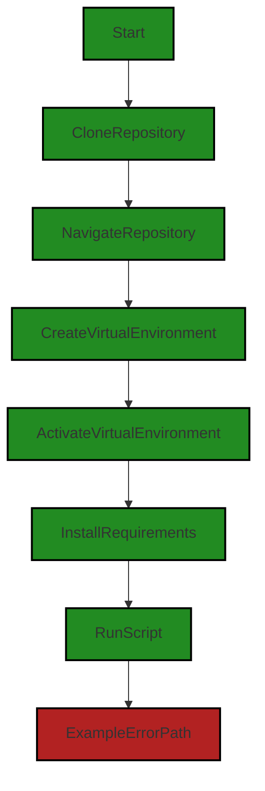

# Polyverse Boost-generated Source Analysis Details

## Source: ./README.md
Date Generated: Tuesday, September 26, 2023 at 9:49:29 AM PDT


---

### Boost Architectural Quick Summary Security Report

Last Updated: Tuesday, September 26, 2023 at 9:48:13 AM PDT

Executive Report:

1. Architectural Impact: The software project appears to have a simple architecture with only one file, README.md, identified in the source code. However, the identified issue in this file is of high severity and could potentially impact the security of the software. The issue is related to the exposure of sensitive data, specifically the OpenAI API key, which is passed as a command-line argument. This could potentially expose the key in system logs or to other users on the same system via commands like 'ps'. This is a significant architectural risk as it could lead to unauthorized access and misuse of the API key.

2. Risk Analysis: The risk associated with this issue is high due to the potential for sensitive data exposure. This could lead to unauthorized access to the API key, which could be used to perform actions on behalf of the software, potentially leading to data breaches or other security incidents. 

3. Potential Customer Impact: Customers could be impacted if the exposed API key is used to access their data or perform actions on their behalf. This could lead to a loss of trust in the software and potential legal implications if customer data is compromised.

4. Overall Issues: The overall health of the source code is concerning due to the high severity of the identified issue. Although only one file was identified in the source code, the issue within this file is of high severity and could have significant implications for the security of the software.

5. Root Cause and Actions: The root cause of this issue appears to be a lack of developer education around secure coding practices. Specific actions that could be taken to address this issue include:
   - Providing training to developers on secure coding practices, specifically around the handling of sensitive data.
   - Implementing a secure method for handling API keys, such as using environment variables or a secure configuration file.
   - Regularly reviewing and updating the software's security practices to ensure they are in line with industry standards.

Highlights:

- The most severe issue identified is the exposure of the OpenAI API key in the README.md file.
- This issue is of high severity and could potentially lead to unauthorized access and misuse of the API key.
- The potential customer impact is high, as the exposed API key could be used to access customer data or perform actions on their behalf.
- The root cause of this issue appears to be a lack of developer education around secure coding practices.
- Recommended actions include providing training to developers, implementing a secure method for handling API keys, and regularly reviewing and updating the software's security practices.


---

### Boost Architectural Quick Summary Performance Report

Last Updated: Tuesday, September 26, 2023 at 9:48:32 AM PDT


Executive Report:

1. **Architectural Impact**: The analysis of this file has not revealed any severe issues.
2. **Risk Analysis**: The analysis of this file has not revealed any severe issues.
3. **Potential Customer Impact**: Based on the analysis, there are no severe issues that could potentially impact customers.
4. **Performance Issues**: Our analysis did not identify any explicit performance issues in the file.
5. **Risk Assessment**: Based on the current analysis of this file, no severe issues have been found. However, this doesn't guarantee that the file is risk-free.

Highlights:

- No severe issues were identified in the current analysis of this file.


---

### Boost Architectural Quick Summary Compliance Report

Last Updated: Tuesday, September 26, 2023 at 9:49:39 AM PDT


Executive Report:

1. **Architectural Impact**: The analysis of this file has not revealed any severe issues.
2. **Risk Analysis**: The analysis of this file has not revealed any severe issues.
3. **Potential Customer Impact**: Based on the analysis, there are no severe issues that could potentially impact customers.
4. **Performance Issues**: Our analysis did not identify any explicit performance issues in the file.
5. **Risk Assessment**: Based on the current analysis of this file, no severe issues have been found. However, this doesn't guarantee that the file is risk-free.

Highlights:

- No severe issues were identified in the current analysis of this file.

---
## Detailed Analysis:

### Cell 0:
## Original Code:

### Programming Language: markdown
### ./README.md 

```markdown
# AI Boosted Order Processing

This tool processes customer orders from an Excel sheet using the OpenAI GPT API.

## Setup

1. Clone the repository:
```bash
git clone https://github.com/your-username/AIBoostedOrderProcessing.git
```

2. Navigate to the repository:
```bash
cd AIBoostedOrderProcessing
```

3. Create a virtual environment:
```bash
python -m venv venv
```

4. Activate the virtual environment:
```bash
# Windows:
venv\Scripts\activate

# macOS and Linux:
source venv/bin/activate
```

5. Install the requirements:
```bash
pip install -r requirements.txt
```

6. Run the Script:
```
python src/aiBoostedOrderProcessor.py <OpenAI_API_KEY> <path_to_excel_file.xlsx>
```

### Command-line Arguments:

1. `OpenAI_API_KEY`: This is your OpenAI GPT API key. It's required for the script to interact with the OpenAI GPT API for processing the orders.

2. `path_to_excel_file.xlsx`: This is the path to your Excel file containing the customer orders. Each row in the Excel file should have two columns: the first one for the customer's email address and the second one for their product order request in natural language.

## Note

Ensure you replace `your-username` in the `git clone` URL with your actual GitHub username.
This README provides a detailed step-by-step guide on setting up the project, installing dependencies, and running the script with the required command-line arguments.

```
## Boost Analysis:


---

### Boost Code Explanation

Last Updated: Monday, September 25, 2023 at 10:49:50 AM PDT

The provided text is not a code but a README file for a project named "AI Boosted Order Processing". This project is designed to process customer orders from an Excel sheet using the OpenAI GPT API. The README file provides detailed instructions on how to setup and use this project.

Here's a summary of the steps:

1. **Clone the repository:** This step involves copying the project from the remote repository to the local machine. The command `git clone https://github.com/your-username/AIBoostedOrderProcessing.git` is used to clone the repository. The user needs to replace `your-username` with their actual GitHub username.

2. **Navigate to the repository:** The `cd AIBoostedOrderProcessing` command is used to change the current directory to the project's directory.

3. **Create a virtual environment:** Python’s virtual environments are used to isolate project-specific dependencies from the global Python environment. The `python -m venv venv` command is used to create a new virtual environment named `venv`.

4. **Activate the virtual environment:** This step involves activating the virtual environment that was just created. The command to activate the virtual environment varies based on the operating system.

5. **Install the requirements:** The `pip install -r requirements.txt` command is used to install the Python dependencies required for this project. These dependencies are listed in the `requirements.txt` file.

6. **Run the Script:** The `python src/aiBoostedOrderProcessor.py <OpenAI_API_KEY> <path_to_excel_file.xlsx>` command is used to run the script. Two command-line arguments are required: the OpenAI GPT API key and the path to the Excel file containing the customer orders.

The OpenAI GPT API is used to process the orders. Each row in the Excel file should have two columns: the first one for the customer's email address and the second one for their product order request in natural language.

Please note that this README does not provide any actual code or algorithms. It is a guide on how to setup and use the project. If you have any code snippets or files from this project, I would be happy to analyse those for you.


---

### Boost Flow Diagram

Last Updated: Tuesday, September 26, 2023 at 9:47:05 AM PDT



In the above control flow graph, the primary path starts at the "Start" node and goes through the steps of cloning the repository, navigating to the repository, creating a virtual environment, activating the virtual environment, installing the requirements, and finally running the script.

The "ExampleErrorPath" represents the error path where an error occurs while running the script.


---

### Boost Source-Level Security Analysis

Last Updated: Tuesday, September 26, 2023 at 9:47:33 AM PDT

1. **Severity**: 7/10

   **Line Number**: 30

   **Bug Type**: Sensitive Data Exposure

   **Description**: The OpenAI API key is passed as a command-line argument. This can expose the key in system logs or to other users on the same system via commands like 'ps'.

   **Solution**: Avoid passing sensitive data like API keys as command-line arguments. Instead, use environment variables or a secure configuration file. Refer to this resource for more information: https://owasp.org/www-project-cheat-sheets/cheatsheets/Protecting_API_Keys_in_a_Client_Side_JavaScript_Web_Application.html


---

### Boost Source-Level Performance Analysis

Last Updated: Tuesday, September 26, 2023 at 9:48:28 AM PDT

**No bugs found**
MIME Type: application/vnd.code.notebook.error

{"name":"Error","message":"Boost Data and Privacy Compliance Analysis failed: Unable to process this source code. This can be caused by a temporary issue with the Boost Cloud Service, or by an issue in the source input. Please try again, and if the problem persists, please contact Boost Support."}

