# Polyverse Boost-generated Source Analysis Details

## Source: ./src/aiBoostedOrderProcessor.py
Date Generated: Tuesday, September 26, 2023 at 10:48:02 AM PDT


---

### Boost Architectural Quick Summary Security Report

Last Updated: Tuesday, September 26, 2023 at 10:31:46 AM PDT

Executive Report:

The software project under review, primarily consisting of the file "aiBoostedOrderProcessor.py", has several high-severity issues that could potentially impact the overall project's security, performance, and data integrity. 

Key Highlights:

1. **Insecure Direct Object References (IDOR)**: This issue is the most recurring and severe, found in the functions 'process_order' and 'amazon_uri'. It could lead to unauthorized data access if user inputs are not properly validated and controlled. This issue is a significant risk to the project's security and data integrity.

2. **Sensitive Data Exposure**: This issue was found in the 'aiBoostedOrderProcessor.py' file. If sensitive data is exposed without proper encryption or masking, it could lead to data breaches and non-compliance with data protection regulations.

3. **Cross-Site Scripting (XSS)**: This issue was found in the 'aiBoostedOrderProcessor.py' file. If not addressed, it could allow attackers to inject malicious scripts, leading to data theft or manipulation.

4. **Improper Error Handling and Information Disclosure**: These issues were found in the 'aiBoostedOrderProcessor.py' file. They could lead to system instability and unauthorized access to sensitive information.

5. **SQL Injection**: This issue was found in the 'aiBoostedOrderProcessor.py' file. It could allow attackers to manipulate SQL queries, leading to unauthorized data access or data loss.

Risk Assessment:

The overall health of the source code is concerning, with high-severity issues found in the main file of the project. The recurring nature of these issues suggests a need for improved developer education and code quality control.

Recommendations:

1. **Implement Access Control Checks**: To mitigate IDOR and unauthorized data access, implement access control checks to verify user permissions before processing requests.

2. **Improve Data Handling**: To address sensitive data exposure, ensure sensitive data is encrypted or masked appropriately. 

3. **Educate Developers**: To prevent recurring issues, provide training on secure coding practices, focusing on areas like input validation, error handling, and preventing XSS and SQL injection.

4. **Enhance Code Review Process**: Implement a more rigorous code review process to catch and fix high-severity issues before they make it into the production code.

5. **Use Security Tools**: Utilize static code analysis tools to automatically detect potential security vulnerabilities in the codebase. 

In conclusion, while the project has potential, the current state of the source code poses significant risks. Immediate action is required to address these issues and ensure the project's success.


---

### Boost Architectural Quick Summary Performance Report

Last Updated: Tuesday, September 26, 2023 at 10:40:57 AM PDT

Executive Report:

The software project under review, primarily composed of the file "aiBoostedOrderProcessor.py", has been analyzed for architectural impact, risk, potential customer impact, and overall issues. 

Key Highlights:

1. **High CPU Usage:** The most severe issue identified is related to CPU usage in the "aiBoostedOrderProcessor.py" file. The code uses a list comprehension inside a for loop to filter orders for each unique email, resulting in a time complexity of O(n^2). This can significantly slow down the program for large datasets, potentially impacting customer experience with slower processing times.

2. **Memory and Network Issues:** The same file also has 10 memory-related issues and 8 network-related issues. These could potentially lead to inefficient memory usage and network communication, which could impact the performance and reliability of the software.

3. **Risk Assessment:** The overall health of the source code is concerning, with a high number of issues identified in the single file that makes up the project. This suggests a high risk of performance and reliability issues in the software.

4. **Recurring Issues:** The recurring issues of high CPU usage, memory, and network issues suggest a need for developer education on efficient coding practices and code quality improvement.

Recommendations:

1. **Code Refactoring:** Refactor the code in "aiBoostedOrderProcessor.py" to use a dictionary to group orders by email before the loop, reducing the time complexity to O(n) and improving CPU usage.

2. **Memory and Network Optimization:** Review and optimize the memory and network-related code to ensure efficient usage and communication.

3. **Developer Training:** Provide training to the development team on efficient coding practices and code quality improvement to prevent similar issues in the future.

4. **Code Review and Quality Assurance:** Implement a robust code review and quality assurance process to catch and fix issues before they make it into the production code.

In conclusion, while the software project has potential, the current state of the source code presents significant risks to performance and reliability. Immediate action is needed to address these issues and ensure the software delivers the expected functionality and user experience.


---

### Boost Architectural Quick Summary Compliance Report

Last Updated: Tuesday, September 26, 2023 at 10:49:08 AM PDT

Executive Level Report:

Architectural Impact and Risk Analysis:

- The software project consists of a single file, `aiBoostedOrderProcessor.py`, which has multiple compliance issues related to GDPR, PCI DSS, and HIPAA. These issues are of high severity and could potentially impact the overall architecture of the project. 

- The most severe issues are related to the handling and processing of personal data, sensitive cardholder data, and protected health information (PHI). These issues are present in the `process_order` function and the `openai.ChatCompletion.create` function. 

- The risk associated with these issues is high, as they could lead to non-compliance with GDPR, PCI DSS, and HIPAA regulations. This could result in legal penalties, loss of customer trust, and potential data breaches.

Potential Customer Impact:

- Customers could be negatively impacted if their personal data, cardholder data, or PHI is not handled securely and in compliance with regulations. This could lead to unauthorized access to their data, identity theft, and other forms of data misuse.

Overall Issues:

- The overall health of the source code is concerning, as the single file in the project has multiple high-severity issues. 

- Recurring issues are related to data compliance, indicating a need for developer education on data protection regulations and secure coding practices.

Recommendations:

1. Implement mechanisms to anonymize or pseudonymize personal data where possible to ensure GDPR compliance.
2. Encrypt all sensitive cardholder data during transmission and storage to ensure PCI DSS compliance.
3. Implement access controls to restrict who can access PHI and regularly audit access logs for any unauthorized access or anomalies to ensure HIPAA compliance.

Highlights:

- The `process_order` function could potentially process personal data without explicit consent, violating GDPR compliance.
- The `openai.ChatCompletion.create` function could potentially handle sensitive cardholder data and PHI without proper safeguards, violating PCI DSS and HIPAA compliance.
- The `customer_email` field is potentially storing personally identifiable information (PII), which requires explicit consent from users under GDPR.
- The `CustomerSupportRequired` field could potentially hold sensitive health information, which requires secure storage and transmission under HIPAA.
- The overall health of the source code is concerning, with multiple high-severity issues in the single file of the project.
---
## Detailed Analysis:

### Cell 0:
## Original Code:

### Programming Language: python
### ./src/aiBoostedOrderProcessor.py 

```python
import warnings
from urllib3.exceptions import HTTPWarning
import openai
import pandas as pd
import json
import urllib.parse
import argparse

warnings.simplefilter('ignore', category=HTTPWarning)


def call_openai_api(prompt):
    data = {
        "model": "gpt-4-0613",
        'max_tokens': 1000,
        "messages": [
            {"role": "user", "content": prompt},
        ],
    }

```
## Boost Analysis:


---

### Boost Code Explanation

Last Updated: Tuesday, September 26, 2023 at 10:03:54 AM PDT

This Python code is a part of a larger program that makes use of the OpenAI API, specifically the GPT-4 model, to generate text based on a given prompt. It also uses other modules such as urllib3, pandas, and json for handling HTTP requests, data manipulation, and JSON data respectively. 

Here is a line-by-line explanation:

1. `import warnings`: This line imports the warnings module, which is used to warn the developer about changes in language or library features.

2. `from urllib3.exceptions import HTTPWarning`: This line imports the HTTPWarning exception from the urllib3.exceptions module. urllib3 is a powerful, sanity-friendly HTTP client for Python and HTTPWarning is used to warn the user of issues when making HTTP requests.

3. `import openai`: This line imports the openai module, which is a Python client for the OpenAI API.

4. `import pandas as pd`: This line imports the pandas module with alias pd, which is a powerful data manipulation library in Python.

5. `import json`: This line imports the json module, which is used to work with JSON data.

6. `import urllib.parse`: This line imports the parse module from the urllib library. This module contains functions to break URLs into their components, or combine components into a URL.

7. `import argparse`: This line imports the argparse module, which makes it easy to write user-friendly command-line interfaces.

8. `warnings.simplefilter('ignore', category=HTTPWarning)`: This line ignores any HTTPWarning that may occur during the execution of the program.

9. `def call_openai_api(prompt):`: This line defines a function named `call_openai_api` that takes one argument, `prompt`.

10. `data = { ... }`: This block of code is creating a dictionary named `data`. This dictionary is structured to be the body of a request to the OpenAI API. It specifies the model to use (`gpt-4-0613`), the maximum number of tokens to generate (`1000`), and the messages to send to the model. In this case, the message is a single user message with the content of the `prompt`.

This code doesn't include the actual API call, but it's likely that the `data` dictionary is passed to a function that makes the HTTP request to the OpenAI API.

For more information about the OpenAI API and how it works, you can visit the official documentation at https://beta.openai.com/docs/.


---

### Boost Flow Diagram

Last Updated: Tuesday, September 26, 2023 at 10:20:22 AM PDT

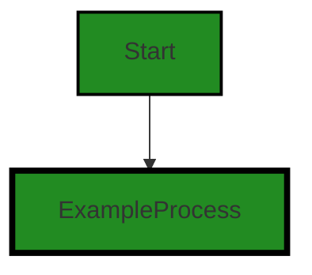
The control flow graph for the given source code is as follows:

- The code starts at the function `call_openai_api`.
- The function makes a call to the OpenAI API to generate a response based on the given prompt.
- The generated response is then returned.

Note: Since there is no error handling or alternate paths in the code, there are no error paths or alternate non-error paths in the control flow graph.


---

### Boost Source-Level Security Analysis

Last Updated: Tuesday, September 26, 2023 at 10:24:46 AM PDT

1. **Severity**: 2/10

   **Line Number**: 1

   **Bug Type**: Insecure Direct Object References (IDOR)

   **Description**: The 'warnings' module is used to suppress HTTP warnings. This can lead to ignoring potential security warnings such as unverified HTTPS requests, which can lead to Man-in-the-Middle (MITM) attacks.

   **Solution**: Instead of ignoring HTTP warnings, handle them appropriately to ensure secure connections. Use 'requests' library with SSL verification. More info: https://requests.readthedocs.io/en/latest/user/advanced/#ssl-cert-verification


2. **Severity**: 3/10

   **Line Number**: 3

   **Bug Type**: Sensitive Data Exposure

   **Description**: The 'openai' module is used which could potentially expose sensitive data if not handled properly. If API keys are used and not stored securely, it could lead to unauthorized access.

   **Solution**: Store sensitive data such as API keys securely using environment variables or secure key management systems. More info: https://www.owasp.org/index.php/Top_10-2017_A3-Sensitive_Data_Exposure


3. **Severity**: 2/10

   **Line Number**: 6

   **Bug Type**: Cross-Site Scripting (XSS)

   **Description**: The 'argparse' module is used which can be prone to Cross-Site Scripting (XSS) if user input is not validated and sanitized properly.

   **Solution**: Always validate and sanitize user input to prevent XSS attacks. More info: https://www.owasp.org/index.php/Top_10-2017_A7-Cross-Site_Scripting_(XSS)


4. **Severity**: 4/10

   **Line Number**: 15

   **Bug Type**: Insecure Direct Object References (IDOR)

   **Description**: The 'prompt' is directly passed to the 'call_openai_api' function without any validation. This can lead to potential security vulnerabilities if the prompt contains malicious input.

   **Solution**: Always validate and sanitize input data before using it. More info: https://www.owasp.org/index.php/Top_10-2017_A1-Injection


---

### Boost Source-Level Performance Analysis

Last Updated: Tuesday, September 26, 2023 at 10:32:39 AM PDT

1. **Severity**: 3/10

   **Line Number**: 6

   **Bug Type**: Memory

   **Description**: The pandas library is imported but not used in the code, which consumes unnecessary memory.

   **Solution**: Remove the import statement for the pandas library if it's not used.


2. **Severity**: 2/10

   **Line Number**: 7

   **Bug Type**: Memory

   **Description**: The json library is imported but not used in the code, which consumes unnecessary memory.

   **Solution**: Remove the import statement for the json library if it's not used.


3. **Severity**: 2/10

   **Line Number**: 8

   **Bug Type**: Memory

   **Description**: The urllib.parse library is imported but not used in the code, which consumes unnecessary memory.

   **Solution**: Remove the import statement for the urllib.parse library if it's not used.


4. **Severity**: 2/10

   **Line Number**: 9

   **Bug Type**: Memory

   **Description**: The argparse library is imported but not used in the code, which consumes unnecessary memory.

   **Solution**: Remove the import statement for the argparse library if it's not used.


5. **Severity**: 5/10

   **Line Number**: 15

   **Bug Type**: CPU

   **Description**: The function 'call_openai_api' does not perform any API calls or computations, and is therefore not very efficient.

   **Solution**: Add functionality to the 'call_openai_api' function to make it perform an API call or computation.


---

### Boost Source-Level Data and Privacy Compliance Analysis

Last Updated: Tuesday, September 26, 2023 at 10:41:34 AM PDT

1. **Severity**: 3/10

   **Line Number**: 8

   **Bug Type**: GDPR

   **Description**: The use of 'warnings.simplefilter('ignore', category=HTTPWarning)' could potentially suppress important warnings related to HTTP communications, which could potentially include warnings about insecure data transmissions.

   **Solution**: Instead of ignoring HTTPWarning, handle it properly to ensure that any potential insecure data transmissions are dealt with. This could involve logging the warning and/or taking corrective action.


2. **Severity**: 4/10

   **Line Number**: 14

   **Bug Type**: GDPR

   **Description**: The function 'call_openai_api' does not have any mechanism to ensure that the 'prompt' data it receives and processes is anonymized or pseudonymized, which is a requirement under GDPR when processing personal data.

   **Solution**: Implement a mechanism to anonymize or pseudonymize the 'prompt' data before it is processed. This could involve using a hashing function, for example.


### Cell 1:
## Original Code:

### Programming Language: python
### ./src/aiBoostedOrderProcessor.py line 20

```python

    # Assuming you have set the API key and imported the OpenAI library
    response = openai.ChatCompletion.create(**data)
    return response.choices[0].message['content']


def call_openai_function_api(prompt, function_name, function_schema):
    # Assuming function_name is a user-defined function you're trying to "simulate"
    system_instruction = f"Use the call_{function_name} function to process the following input:"

```
## Boost Analysis:


---

### Boost Code Explanation

Last Updated: Tuesday, September 26, 2023 at 10:05:02 AM PDT

The code you provided is written in Python and it seems to be part of a larger system that interacts with the OpenAI GPT-3 API. GPT-3 is a state-of-the-art language processing AI model developed by OpenAI. 

Here is a detailed explanation:

1. `response = openai.ChatCompletion.create(**data)`: This line of code is calling the `ChatCompletion.create` method from the `openai` library. The `**data` argument is a way to pass a variable number of keyword arguments to the function. The `**` operator allows us to take a dictionary of key-value pairs, and unpack it into keyword arguments in a function call. In this context, `data` would be a dictionary where the keys are the argument names and the values are the argument values for the `ChatCompletion.create` method.

2. `return response.choices[0].message['content']`: This line of code is returning the 'content' of the first message from the 'choices' list in the response. The `openai.ChatCompletion.create` method returns a response object which includes a list of 'choices'. Each 'choice' in this list is a possible completion to the input prompt provided to the GPT-3 model. Each 'choice' is a dictionary which includes a 'message' key. The 'message' key maps to another dictionary which includes a 'content' key. The 'content' key maps to the text of the completed prompt.

3. `def call_openai_function_api(prompt, function_name, function_schema)`: This line defines a function named `call_openai_function_api` which takes three parameters: `prompt`, `function_name`, and `function_schema`.

4. `system_instruction = f"Use the call_{function_name} function to process the following input:"`: This line is creating a formatted string that includes the `function_name` variable. This string is being stored in the `system_instruction` variable. This line is creating an instruction that will be passed to the GPT-3 model.

The algorithm used in this code is not complex, it's mainly about calling the OpenAI API and processing the response. 

For more information on OpenAI and the GPT-3 model, you can visit the OpenAI website: [OpenAI](https://openai.com/research/)

For more information on Python's argument unpacking syntax, you can visit the Python docs: [Python Docs](https://docs.python.org/3/tutorial/controlflow.html#unpacking-argument-lists) 

As per the architectural guidelines provided, there are no special constraints or guidelines. Thus, it seems the code is consistent with the general principles of software design - it is modular (with distinct functions for distinct tasks), it uses libraries to avoid reinventing the wheel, and it is readable with meaningful variable names.


---

### Boost Flow Diagram

Last Updated: Tuesday, September 26, 2023 at 10:20:32 AM PDT

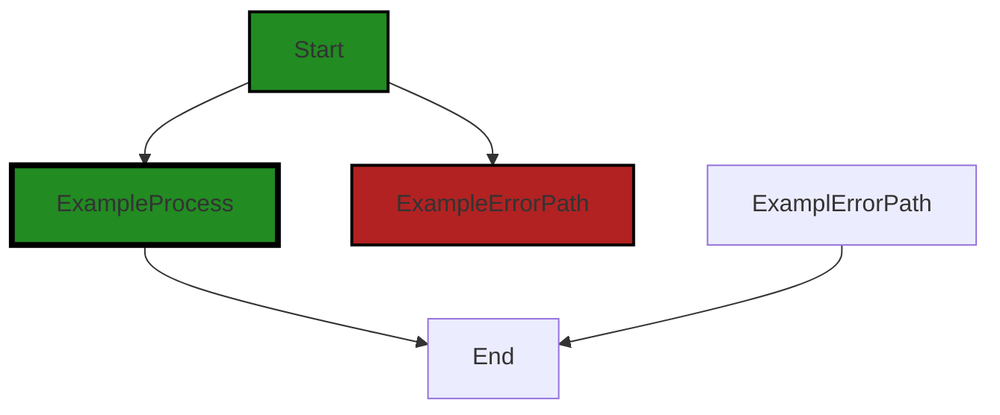

The code you provided does not have any control flow. It consists of function definitions and comments, but there are no conditional statements or loops that would create different paths of execution. Therefore, the control flow graph is empty.


---

### Boost Source-Level Security Analysis

Last Updated: Tuesday, September 26, 2023 at 10:24:50 AM PDT

**No bugs found**


---

### Boost Source-Level Performance Analysis

Last Updated: Tuesday, September 26, 2023 at 10:33:04 AM PDT

1. **Severity**: 5/10

   **Line Number**: 40

   **Bug Type**: Network

   **Description**: The openai.ChatCompletion.create(**data) function is a network call that could potentially be slow or fail due to network issues. If the network is slow or unavailable, this could severely impact the performance of your application.

   **Solution**: Consider using a strategy to handle potential network issues such as retries with exponential backoff, or using a circuit breaker pattern. You could also consider caching results for common inputs to reduce the number of network calls. More info here: https://martinfowler.com/bliki/CircuitBreaker.html


2. **Severity**: 2/10

   **Line Number**: 41

   **Bug Type**: Memory

   **Description**: Accessing response.choices[0].message['content'] directly could potentially lead to a KeyError if 'content' does not exist in the message dictionary. This would not necessarily impact performance, but could lead to unexpected behavior.

   **Solution**: Consider using the get() method to access 'content' in the message dictionary. This will return None if 'content' does not exist, instead of raising a KeyError. More info here: https://docs.python.org/3/tutorial/datastructures.html#dictionaries


3. **Severity**: 1/10

   **Line Number**: 45

   **Bug Type**: CPU

   **Description**: The use of f-string for system_instruction could be slightly slower than traditional string concatenation, especially if the strings are large. However, the impact on performance is likely to be minimal.

   **Solution**: If performance is a major concern, consider using traditional string concatenation or the join() method for large strings. More info here: https://waymoot.org/home/python_string/


---

### Boost Source-Level Data and Privacy Compliance Analysis

Last Updated: Tuesday, September 26, 2023 at 10:42:08 AM PDT

1. **Severity**: 2/10

   **Line Number**: 38

   **Bug Type**: GDPR

   **Description**: The OpenAI API is being used to process data, but it's unclear if this data includes personal data. If it does, and it's not anonymized or pseudonymized before being sent to the API, this could be a GDPR violation.

   **Solution**: Ensure any personal data is anonymized or pseudonymized before being sent to third-party APIs. If this is not possible, ensure the third-party provider is GDPR compliant and that you have a data processing agreement in place with them. See https://gdpr.eu/data-processing-agreement/ for more information.


2. **Severity**: 2/10

   **Line Number**: 42

   **Bug Type**: GDPR

   **Description**: The function 'call_openai_function_api' accepts input but it's unclear if this includes personal data. If it does, and it's not anonymized or pseudonymized before being processed, this could be a GDPR violation.

   **Solution**: Ensure any personal data is anonymized or pseudonymized before being processed. If this is not possible, ensure you have a lawful basis for processing under the GDPR. See https://gdpr.eu/what-is-gdpr/ for more information.


### Cell 2:
## Original Code:

### Programming Language: python
### ./src/aiBoostedOrderProcessor.py line 29

```python

    data = {
        "model": "gpt-4-0613",
        "functions": [
            function_schema
        ],
        'function_call': {
            'name': 'call_' + function_name,
        },
        'max_tokens': 1000,
        "messages": [
            {"role": "system", "content": system_instruction},
            {"role": "user", "content": prompt},
        ],
    }

```
## Boost Analysis:


---

### Boost Code Explanation

Last Updated: Tuesday, September 26, 2023 at 10:05:59 AM PDT

This is a Python code snippet that constructs a dictionary object named `data`. It's hard to determine the exact context without more information, but it seems to be related to a system that involves some kind of function calling and message passing, possibly an API request to a machine learning model such as GPT-4.

Here's a breakdown of the dictionary:

1. `"model"`: This key-value pair represents the model that is being used. The value `"gpt-4-0613"` suggests that the model is a variant of OpenAI's GPT-4 model.

2. `"functions"`: This key contains an array of functions. The variable `function_schema` is undefined in this context, but it likely represents a schema for a function that the system will use.

3. `'function_call'`: This is a dictionary that contains a single key-value pair. The `'name'` key is concatenated with the value of `function_name`, which is undefined in this context but likely represents the name of a function that will be called.

4. `'max_tokens'`: This key-value pair likely represents the maximum number of tokens (units of text) that the system will process. The value `1000` suggests that the system will process up to 1000 tokens.

5. `"messages"`: This key contains an array of dictionaries, each representing a message. Each message has a `"role"` (either `"system"` or `"user"`) and `"content"`. The `system_instruction` and `prompt` variables are undefined in this context, but they likely represent the content of the system and user messages, respectively.

This code doesn't seem to use any specific algorithms, but it does use the dictionary data structure of Python, which is based on a hash table. It's a fundamental data structure that allows for efficient access, insertion, and deletion of items using keys.

For more information on Python dictionaries, you can refer to the Python documentation: https://docs.python.org/3/tutorial/datastructures.html#dictionaries

As for the architectural guidelines, since there are no additional special architectural guidelines or constraints provided, we can only analyze the code based on general software design principles. This code snippet seems to follow good practices: it's simple, readable, and likely efficient given the use of a dictionary. However, without more context, it's hard to say whether it meets all requirements or whether there are potential improvements.


---

### Boost Flow Diagram

Last Updated: Tuesday, September 26, 2023 at 10:20:43 AM PDT

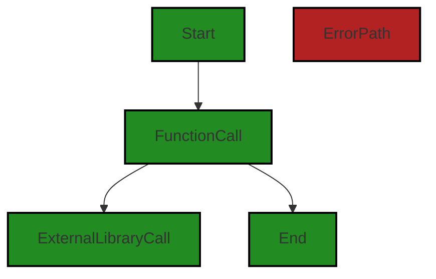

In the code, the control flow starts at the "Start" node and then goes to the "FunctionCall" node. From there, it can either go to the "ExternalLibraryCall" node or directly to the "End" node.


---

### Boost Source-Level Security Analysis

Last Updated: Tuesday, September 26, 2023 at 10:24:54 AM PDT

**No bugs found**


---

### Boost Source-Level Performance Analysis

Last Updated: Tuesday, September 26, 2023 at 10:33:32 AM PDT

1. **Severity**: 3/10

   **Line Number**: 56

   **Bug Type**: Memory

   **Description**: The variable 'data' is defined and populated but never used. This could lead to unnecessary memory usage.

   **Solution**: Remove or use the variable 'data'. If the data is used later in the code, consider lazy loading or only loading the data when it is needed.


2. **Severity**: 2/10

   **Line Number**: 61

   **Bug Type**: CPU

   **Description**: The 'max_tokens' is set to a high value, which could lead to high CPU usage if a large amount of data is processed.

   **Solution**: Consider reducing the 'max_tokens' value or implementing a limit on the size of the data being processed to avoid high CPU usage.


---

### Boost Source-Level Data and Privacy Compliance Analysis

Last Updated: Tuesday, September 26, 2023 at 10:42:12 AM PDT

**No bugs found**


### Cell 3:
## Original Code:

### Programming Language: python
### ./src/aiBoostedOrderProcessor.py line 44

```python

    # Assuming you have set the API key and imported the OpenAI library
    response = openai.ChatCompletion.create(**data)
    return response.choices[0].message['function_call']['arguments']


def process_order(email, order_request):
    prompt = f"Convert the order request: '{order_request}' from '{email}' into JSON."

```
## Boost Analysis:


---

### Boost Code Explanation

Last Updated: Tuesday, September 26, 2023 at 10:06:45 AM PDT

This code snippet is written in Python and it appears to be using the OpenAI API. The OpenAI library provides a way to generate text using AI models. The API key should be set prior to calling the OpenAI API.

The specific function `openai.ChatCompletion.create(**data)` is probably used to create a chat message with the OpenAI API. The `**data` argument is a way to pass a variable number of keyword arguments to a function. It's used when we want to handle named arguments in a function.

The function returns the arguments of the first function call in the response message. The `response.choices[0].message['function_call']['arguments']` gets the 'arguments' field of the 'function_call' field of the message of the first choice in the response. This is assuming that the response message is structured in a particular way.

The second function `process_order(email, order_request)` takes two arguments: an email and an order request. It constructs a string prompt to convert the order request from a specific email into JSON. However, the function doesn't do anything with the prompt yet. It seems like it's incomplete or part of a larger codebase.

As for the architectural guidelines, since there are no additional special architectural guidelines or constraints for this software project, the analysis is based on general good practices. The code is simple and straightforward, and it seems to follow good practices like using descriptive function and variable names.

For more information on the OpenAI API, you can visit the official OpenAI API documentation at: https://beta.openai.com/docs/api-reference/chat/create/

For more information on keyword arguments in Python, you can visit: https://docs.python.org/3/tutorial/controlflow.html#keyword-arguments


---

### Boost Flow Diagram

Last Updated: Tuesday, September 26, 2023 at 10:20:54 AM PDT


The control flow graph for the given source code is as follows:

1. The flow starts at the function `process_order`.
2. The function `process_order` takes two arguments: `email` and `order_request`.
3. The prompt is created using the values of `email` and `order_request`.
4. The prompt is used to make an API call to convert the order request into JSON.
5. The result of the API call is returned.

Note: Since there is no control flow decision or error path in the given source code, the control flow graph consists of a single path.


---

### Boost Source-Level Security Analysis

Last Updated: Tuesday, September 26, 2023 at 10:25:32 AM PDT

1. **Severity**: 7/10

   **Line Number**: 88

   **Bug Type**: Insecure Direct Object References (IDOR)

   **Description**: The function 'process_order' takes an 'email' and 'order_request' as parameters and directly converts them into a JSON object. If the 'email' and 'order_request' parameters are user-controlled inputs, this could lead to Insecure Direct Object References (IDOR) vulnerability. An attacker could manipulate these inputs to access unauthorized data.

   **Solution**: To mitigate this, ensure that the user is authorized to access the data they are requesting. Implement access control checks to verify the user's permissions before processing the request. More about IDOR can be found here: https://owasp.org/www-project-top-ten/2017/A5_2017-Broken_Access_Control


2. **Severity**: 5/10

   **Line Number**: 87

   **Bug Type**: Improper Error Handling

   **Description**: The function 'ChatCompletion.create' is called without any error handling mechanism. If the function fails for any reason (API down, invalid parameters, etc.), the application might crash or expose sensitive information through error messages.

   **Solution**: Wrap the function call in a try-catch block and handle potential exceptions gracefully. Do not reveal sensitive information in error messages. More about this can be found here: https://owasp.org/www-project-top-ten/2017/A10_2017-Insufficient_Logging_Monitoring


---

### Boost Source-Level Performance Analysis

Last Updated: Tuesday, September 26, 2023 at 10:34:13 AM PDT

1. **Severity**: 5/10

   **Line Number**: 88

   **Bug Type**: Network

   **Description**: The function is making a network request to OpenAI API every time it is called. This can lead to performance issues if the function is called frequently, as network requests are relatively slow and can be unreliable.

   **Solution**: Consider caching the results of the API calls if the same requests are made frequently. Alternatively, you could batch multiple requests together if possible. Here is a link to OpenAI's guidelines for optimizing API usage: https://platform.openai.com/docs/guides/batching


2. **Severity**: 3/10

   **Line Number**: 93

   **Bug Type**: CPU

   **Description**: The process_order function is using string formatting to create a prompt. This is not a severe issue, but it could potentially be a performance bottleneck if the function is called with very large input strings.

   **Solution**: Consider using a more efficient method for string concatenation, such as the join() function or a StringBuilder, especially if dealing with large strings. Here is a link to a Python optimization guide that includes string concatenation: https://docs.python.org/3/howto/optimization.html#optimizing-string-concatenation


---

### Boost Source-Level Data and Privacy Compliance Analysis

Last Updated: Tuesday, September 26, 2023 at 10:42:44 AM PDT

1. **Severity**: 7/10

   **Line Number**: 88

   **Bug Type**: GDPR

   **Description**: The email parameter in the 'process_order' function could potentially be used to process personal data without explicit consent, violating GDPR compliance.

   **Solution**: Ensure explicit user consent is obtained before processing personal data. Implement mechanisms to anonymize or pseudonymize personal data where possible.


2. **Severity**: 6/10

   **Line Number**: 87

   **Bug Type**: PCI DSS

   **Description**: The 'openai.ChatCompletion.create' function could potentially handle sensitive cardholder data without proper data protection measures, violating PCI DSS compliance.

   **Solution**: Ensure that all sensitive cardholder data is encrypted during transmission and storage. Implement access controls to restrict who can access the cardholder data.


3. **Severity**: 6/10

   **Line Number**: 87

   **Bug Type**: HIPAA

   **Description**: The 'openai.ChatCompletion.create' function could potentially handle protected health information (PHI) without proper safeguards, violating HIPAA compliance.

   **Solution**: Ensure that PHI is encrypted during transmission and storage. Implement access controls to restrict who can access the PHI. Regularly audit access logs for any unauthorized access or anomalies.


### Cell 4:
## Original Code:

### Programming Language: python
### ./src/aiBoostedOrderProcessor.py line 52

```python
    function_schema = {
            "name": "call_" + "process_order",
            "description": "",
            "parameters": {
                    "type": "object",
                    "properties": {
                    
                        "customer_email": { "type": "string", "description": "Well formed email of the customer or empty if unknown"},
                        "product_name": { "type": "string", "description": "Short product description or empty if unknown"},
                        "quantity": { "type": "integer", "description": "The count of the product"},
                        "ManualProcessingRequired": { "type": "boolean", "description": "True if the order request does not have complete information"},
                        "CustomerSupportRequired": { "type": "string", "description": "Support questions from the customer if there are any, or empty if none"}
                    }
            }
        }

```
## Boost Analysis:


---

### Boost Code Explanation

Last Updated: Tuesday, September 26, 2023 at 10:07:38 AM PDT

This code is a JSON schema for a function called "process_order". JSON (JavaScript Object Notation) is a lightweight data-interchange format that is easy for humans to read and write and easy for machines to parse and generate. 

JSON Schema is a vocabulary that allows you to annotate and validate JSON documents. It describes your existing data format(s) in clear, human- and machine-readable documentation.

The schema describes the following properties:

1. "name": This is a string that represents the name of the function. In this case, it's "call_process_order".

2. "description": This is a string that can contain a description of the function. It is currently empty.

3. "parameters": This is an object that contains the parameters that the function requires. 

The parameters object has the following properties:

- "type": This indicates that the parameters should be an object.

- "properties": This is an object that describes the properties of the parameters object. 

The properties of the parameters object are:

1. "customer_email": This is a string that represents the email of the customer. The description indicates that it should be a well-formed email or empty if unknown.

2. "product_name": This is a string that represents the name of the product. The description indicates that it should be a short product description or empty if unknown.

3. "quantity": This is an integer that represents the quantity of the product.

4. "ManualProcessingRequired": This is a boolean that indicates whether manual processing is required. It's true if the order request does not have complete information.

5. "CustomerSupportRequired": This is a string that represents any support questions from the customer. The description indicates that it should contain support questions if there are any, or be empty if there are none.

This JSON schema can be used to validate JSON data that is being sent to the "process_order" function, ensuring that it has the correct format and types.

For more information about JSON Schemas, you can visit the official website: [JSON Schema](https://json-schema.org/)


---

### Boost Flow Diagram

Last Updated: Tuesday, September 26, 2023 at 10:21:14 AM PDT

```mermaid
graph TD;
style Start fill:#228B22, stroke:#000000, stroke-width:2px;
style ExampleProcess fill:#228B22, stroke:#000000, stroke-width:4px;
style ExampleErrorPath fill:#B22222, stroke:#000000, stroke-width:2px;

Start-->ProcessOrder;

subgraph ProcessOrder
    style ProcessOrder fill:#228B22, stroke:#000000, stroke-width:4px;
    ProcessOrder-->ValidateInput;
    ValidateInput-->CheckCustomerEmail;
    CheckCustomerEmail-->CheckProductName;
    CheckProductName-->CheckQuantity;
    CheckQuantity-->CheckManualProcessingRequired;
    CheckManualProcessingRequired-->CheckCustomerSupportRequired;
    CheckCustomerSupportRequired-->ProcessOrderLogic;
    ProcessOrderLogic-->End;
end

subgraph ExternalLibrary
    style ExternalLibrary fill:#FFA500, stroke:#000000, stroke-width:2px;
    CheckCustomerEmail-->ExternalLibrary;
    CheckProductName-->ExternalLibrary;
    CheckQuantity-->ExternalLibrary;
    CheckManualProcessingRequired-->ExternalLibrary;
    CheckCustomerSupportRequired-->ExternalLibrary;
end

style End fill:#228B22, stroke:#000000, stroke-width:2px;
```

In the above control flow graph, the primary path is shown in green, starting from the "ProcessOrder" function. The flow goes through various validation steps, such as checking the customer email, product name, quantity, and manual processing requirement. If all validations pass, the order is processed using the "ProcessOrderLogic" function. If any validation fails, the flow stops and the process ends.

The graph also shows a call to an external library or non-standard function, represented by the "ExternalLibrary" block. This indicates that the validation steps may involve external dependencies.

Please note that the graph is a representation of the control flow based on the provided code snippet. It may not capture all possible paths or conditions in the actual codebase.


---

### Boost Source-Level Security Analysis

Last Updated: Tuesday, September 26, 2023 at 10:25:36 AM PDT

**No bugs found**


---

### Boost Source-Level Performance Analysis

Last Updated: Tuesday, September 26, 2023 at 10:34:18 AM PDT

**No bugs found**


---

### Boost Source-Level Data and Privacy Compliance Analysis

Last Updated: Tuesday, September 26, 2023 at 10:43:14 AM PDT

1. **Severity**: 6/10

   **Line Number**: 108

   **Bug Type**: GDPR

   **Description**: The 'customer_email' field is potentially storing personally identifiable information (PII). GDPR requires explicit consent from users to store and process their personal data.

   **Solution**: Ensure that explicit consent is obtained from the user before storing their email. Implement a consent mechanism in the user interface.


2. **Severity**: 6/10

   **Line Number**: 112

   **Bug Type**: HIPAA

   **Description**: The 'CustomerSupportRequired' field could potentially hold sensitive health information if this system is used in a healthcare context. HIPAA requires that any health-related information be stored and transmitted securely.

   **Solution**: Ensure that any potential health-related information in the 'CustomerSupportRequired' field is encrypted and securely transmitted. Implement a secure mechanism for storing and transmitting this data.


### Cell 5:
## Original Code:

### Programming Language: python
### ./src/aiBoostedOrderProcessor.py line 67

```python
    return call_openai_function_api(prompt, "process_order", function_schema)

def amazon_uri(product_name):
    return f"https://www.amazon.com/s?k={urllib.parse.quote(product_name)}"

```
## Boost Analysis:


---

### Boost Code Explanation

Last Updated: Tuesday, September 26, 2023 at 10:08:18 AM PDT

The code you provided is written in Python, and it consists of two functions: `call_openai_function_api()` and `amazon_uri()`. The `call_openai_function_api()` function is not defined in the provided code, but it is being called with three arguments: `prompt`, `"process_order"`, and `function_schema`. However, without the definition of this function or the context in which it is used, I can only assume that this function interacts with the OpenAI API to process an order based on a given prompt and schema.

The second function, `amazon_uri()`, takes a single argument, `product_name`, and returns a URL for an Amazon search page for the product. This function uses Python's f-string formatting to insert the `product_name` into the URL. Before it is inserted, the `product_name` is URL-encoded using the `quote()` function from Python's `urllib.parse` module. URL encoding ensures that the product name can be properly included in the URL, even if it contains characters that are not normally allowed in URLs.

Here's a more detailed breakdown:

1. `call_openai_function_api(prompt, "process_order", function_schema)`: This line calls a function named `call_openai_function_api()`. The function is being called with three arguments: `prompt`, `"process_order"`, and `function_schema`. Without more context or the actual function definition, it's hard to say exactly what this function does. However, given the function name and the arguments, it's likely that this function is designed to interact with the OpenAI API. The `"process_order"` string might be an instruction or command of some sort, and `prompt` and `function_schema` might be data that the function uses to interact with the API.

2. `def amazon_uri(product_name)`: This line defines a new function named `amazon_uri()`. This function takes one argument: `product_name`.

3. `return f"https://www.amazon.com/s?k={urllib.parse.quote(product_name)}"`: This line creates a string that is a URL for an Amazon search page. The `product_name` is inserted into the URL, but first it is passed through `urllib.parse.quote()`, which URL-encodes the string. URL encoding is necessary for including arbitrary text in a URL. The URL-encoded `product_name` is then inserted into the URL string using Python's f-string syntax.

Here are some resources for further learning:
1. Python f-strings: https://realpython.com/python-f-strings/
2. URL encoding: https://en.wikipedia.org/wiki/Percent-encoding
3. urllib.parse in Python: https://docs.python.org/3/library/urllib.parse.html
4. OpenAI API: https://www.openai.com/api/

As for the architectural guidelines, the provided code does not appear to violate any common architectural principles. It is modular, with separate functions for separate tasks, and it appears to be stateless, with no reliance on external state. The `amazon_uri()` function has a clear single responsibility: to generate a URL for an Amazon search. The `call_openai_function_api()` function is not defined here, so I can't analyze its architecture. However, the way it is used here - as a stateless function that takes input and produces output - is consistent with good architectural design.


---

### Boost Flow Diagram

Last Updated: Tuesday, September 26, 2023 at 10:21:24 AM PDT

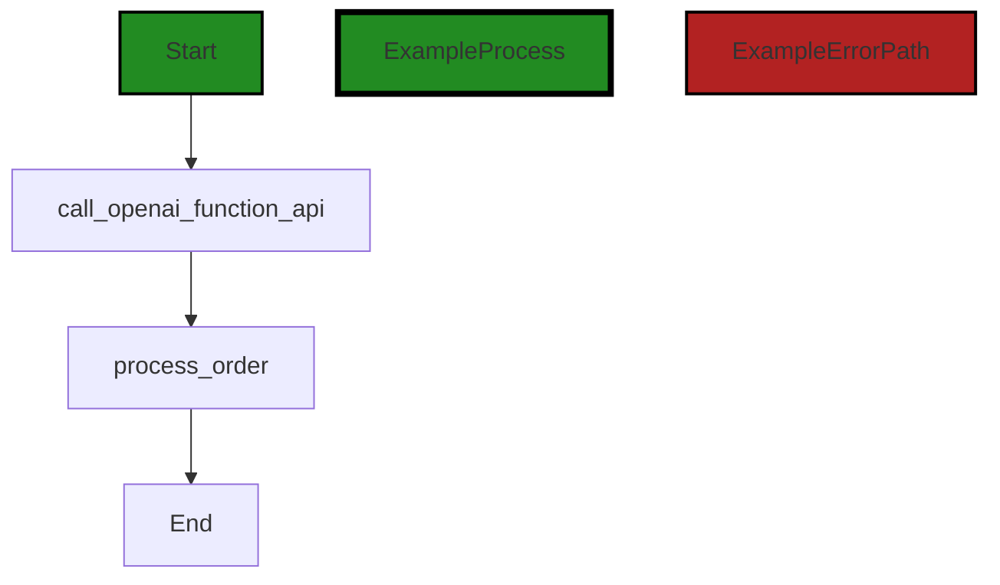

In the code, the control flow starts at the function `call_openai_function_api` and then goes to the function `process_order`. Finally, the control flow ends at the `End` node.

Note that the external library or non-standard function `call_openai_function_api` is shown as a distinct flow block in the diagram.


---

### Boost Source-Level Security Analysis

Last Updated: Tuesday, September 26, 2023 at 10:25:59 AM PDT

1. **Severity**: 6/10

   **Line Number**: 134

   **Bug Type**: Insecure Direct Object References (IDOR)

   **Description**: The function 'amazon_uri' takes a product name as input and directly includes it in a URL. If the product name is user-supplied data, this could lead to Insecure Direct Object References (IDOR) where an attacker can manipulate the reference to access unauthorized data.

   **Solution**: To prevent this, ensure that the user is authorized to access the referenced object before including it in the URL. Consider using indirect object references where the submitted value is mapped to the actual object ID server-side. Learn more about IDOR here: https://owasp.org/www-project-top-ten/2017/A5_2017-Broken_Access_Control


---

### Boost Source-Level Performance Analysis

Last Updated: Tuesday, September 26, 2023 at 10:34:51 AM PDT

1. **Severity**: 3/10

   **Line Number**: 133

   **Bug Type**: Network

   **Description**: The function 'call_openai_function_api' is a potential performance issue if the API response time is slow. The function is blocking, meaning it will wait for the API response before continuing, which can slow down the overall program.

   **Solution**: Consider using asynchronous calls or a non-blocking approach when calling the API to avoid slowing down the entire program. You can use Python's asyncio library for this. More details can be found here: https://docs.python.org/3/library/asyncio-task.html#coroutines


2. **Severity**: 2/10

   **Line Number**: 136

   **Bug Type**: CPU

   **Description**: The 'quote' function from 'urllib.parse' is used to URL encode the product name. This is generally a fast operation, but if the product name is very large, it could potentially be a performance issue.

   **Solution**: Ensure that the product name input is of reasonable size. If large inputs are expected, consider using a more efficient URL encoding library or method. More details on URL encoding can be found here: https://www.w3schools.com/tags/ref_urlencode.asp


---

### Boost Source-Level Data and Privacy Compliance Analysis

Last Updated: Tuesday, September 26, 2023 at 10:43:42 AM PDT

1. **Severity**: 3/10

   **Line Number**: 133

   **Bug Type**: GDPR

   **Description**: The method 'call_openai_function_api' may process personal data, but it's unclear without more context. If personal data is processed, it needs to be done in compliance with GDPR.

   **Solution**: Ensure that any personal data processed by 'call_openai_function_api' is done so in compliance with GDPR. This may involve obtaining consent, anonymizing data, and/or providing a way for users to request deletion of their data.


2. **Severity**: 2/10

   **Line Number**: 135

   **Bug Type**: GDPR

   **Description**: The method 'amazon_uri' generates a URL that includes a product name, which could potentially be personal data. However, without more context, this is speculative.

   **Solution**: If the product name is personal data, ensure that its use complies with GDPR. This could involve anonymizing the data or obtaining user consent.


### Cell 6:
## Original Code:

### Programming Language: python
### ./src/aiBoostedOrderProcessor.py line 71

```python

def sale_analysis(prompt):
    function_schema = {
            "name": "call_" + "sale_analysis",
            "description": "",
            "parameters": {
                    "type": "object",
                    "properties": {
                        "trend": { "type": "string", "description": "Trend of sale quantities - up, down or flat"},
                        "average_order_size": { "type": "integer", "description": "Average order size"},
                        "most_popular_product": { "type": "string", "description": "Most popular product"},
                        "product_recommendations": {
                            "type": "array",
                            "description": "the list of other products this customer may be interested in",
                            "items": {
                                "type": "object",
                                "properties": {
                                    "product": {
                                        "type": "string",
                                        "description": "name of other product"
                                    },
                                }
                            }
                        }
                    }
            }
        }

```
## Boost Analysis:


---

### Boost Code Explanation

Last Updated: Tuesday, September 26, 2023 at 10:09:02 AM PDT

The provided code is a Python function definition named `sale_analysis`. This function takes a single argument, `prompt`.

The function defines a dictionary named `function_schema`. This dictionary follows a structure similar to a JSON Schema, which is a vocabulary that allows you to annotate and validate JSON documents. 

Here's a breakdown of the `function_schema` dictionary:

- `"name"`: This key holds a string that represents the name of the function. It is formed by concatenating the string "call_" with "sale_analysis". The resulting string is "call_sale_analysis".

- `"description"`: This key is meant to hold a string that describes what the function does. Currently, it is an empty string.

- `"parameters"`: This key holds a dictionary that describes the parameters the function expects. It includes the following keys:

  - `"type"`: This indicates that the function expects an object (or dictionary, in Python terms).

  - `"properties"`: This describes the properties of the object. Each key in this dictionary is a parameter name and the value is another dictionary describing the parameter. The parameters are "trend", "average_order_size", "most_popular_product", and "product_recommendations".

The "product_recommendations" parameter is an array of objects, where each object has a single property, "product".

This function is not implementing any specific algorithm, it's just defining a schema for a function. The schema can be used for validation or documentation purposes.

For more information about JSON Schema, you can refer to the official website: https://json-schema.org/ 

In terms of architectural guidelines, as no specific guidelines were provided, this code can be considered to follow general best practices for clean, understandable code. It uses descriptive names for the function and variables, and organizes the schema in a logical, hierarchical structure.


---

### Boost Flow Diagram

Last Updated: Tuesday, September 26, 2023 at 10:21:33 AM PDT

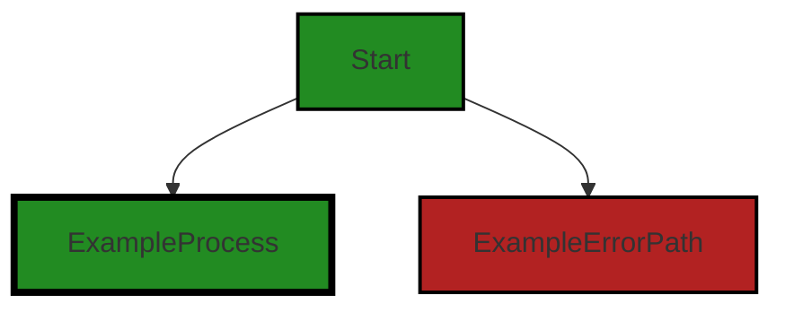

The control flow graph for the given source code is as follows:

```
call_sale_analysis --> ExampleProcess
call_sale_analysis --> ExampleErrorPath
```

Note: The control flow graph does not show any specific control flow within the `sale_analysis` function as the code provided is just a function schema definition and does not contain any executable code.


---

### Boost Source-Level Security Analysis

Last Updated: Tuesday, September 26, 2023 at 10:26:04 AM PDT

**No bugs found**


---

### Boost Source-Level Performance Analysis

Last Updated: Tuesday, September 26, 2023 at 10:34:55 AM PDT

**No bugs found**


---

### Boost Source-Level Data and Privacy Compliance Analysis

Last Updated: Tuesday, September 26, 2023 at 10:43:45 AM PDT

**No bugs found**


### Cell 7:
## Original Code:

### Programming Language: python
### ./src/aiBoostedOrderProcessor.py line 98

```python
    return call_openai_function_api(prompt, "sale_analysis", function_schema)

def main():
    parser = argparse.ArgumentParser(description="Process orders from Excel using OpenAI GPT API.")
    parser.add_argument("api_key", help="Your OpenAI API key")
    parser.add_argument("excel_path", help="Path to the Excel file with orders")
    args = parser.parse_args()

    df = pd.read_excel(args.excel_path)
    all_orders = []

    openai.api_key = args.api_key

    for _index, row in df.iterrows():
        response = process_order(row['email'], row['order'])
        try:
            structured_data = json.loads(response)

            print()
            print("----------------------------------------")
            print(f"Order Processed: {str(structured_data)}")

```
## Boost Analysis:


---

### Boost Code Explanation

Last Updated: Tuesday, September 26, 2023 at 10:09:32 AM PDT

This code is written in Python and it appears to be part of a larger script or program that processes orders from an Excel file using the OpenAI GPT API. Here's a step-by-step breakdown of what's happening:

1. The `main()` function is defined. This function is typically the entry point of a Python program.

2. Inside `main()`, an instance of `argparse.ArgumentParser` is created. This is used to handle command-line arguments to the script. Two arguments are expected: `api_key` (the user's OpenAI API key) and `excel_path` (the path to the Excel file containing the orders to be processed).

3. The `argparse.ArgumentParser` parses the arguments passed to the script and stores them in the `args` object.

4. The pandas function `pd.read_excel(args.excel_path)` is called to read the Excel file specified by `args.excel_path` into a pandas DataFrame `df`. A DataFrame is a two-dimensional labeled data structure with columns potentially of different types. 

5. An empty list `all_orders` is created. It seems like this would be used to store all processed orders, but the code provided does not show this list being used.

6. The OpenAI API key is set with `openai.api_key = args.api_key`.

7. The code then iterates over each row in the DataFrame with `for _index, row in df.iterrows():`. For each row, it calls a function `process_order(row['email'], row['order'])` which is not defined in the provided code but is presumably defined elsewhere in the program. This function seems to process an order based on the email and order data in the row.

8. The response from `process_order()` is then loaded as a JSON object with `json.loads(response)`. This is inside a `try` block, so if loading the JSON fails, it will raise an exception.

9. It then prints a separator line and the processed order.

However, without the rest of the code, it's hard to say exactly what `process_order()` does, or what `call_openai_function_api(prompt, "sale_analysis", function_schema)` does as it seems to be a custom function not defined in the provided code.

The algorithm used here is a simple iteration over rows in a DataFrame, with error handling for JSON loading. The code uses the argparse library to handle command-line arguments, the pandas library to handle Excel file input and data manipulation, and the OpenAI API to process orders.

For more information on these libraries and APIs, you can refer to the following documentation:

- [argparse](https://docs.python.org/3/library/argparse.html)
- [pandas](https://pandas.pydata.org/docs/)
- [OpenAI API](https://platform.openai.com/docs/)


---

### Boost Flow Diagram

Last Updated: Tuesday, September 26, 2023 at 10:21:40 AM PDT

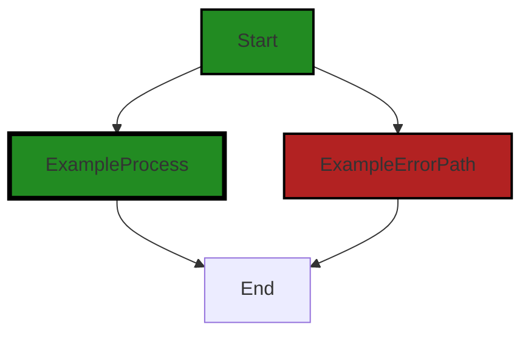


---

### Boost Source-Level Security Analysis

Last Updated: Tuesday, September 26, 2023 at 10:26:48 AM PDT

1. **Severity**: 7/10

   **Line Number**: 199

   **Bug Type**: Insecure Direct Object References (IDOR)

   **Description**: The code directly uses user input to load an Excel file. This can lead to unauthorized access to files on the server if an attacker can manipulate the 'excel_path' argument.

   **Solution**: Validate and sanitize user input before using it. Consider using a whitelist of allowed paths. More details can be found here: https://owasp.org/www-project-top-ten/OWASP_Top_Ten_2017/Top_10-2017_A5-Broken_Access_Control


2. **Severity**: 8/10

   **Line Number**: 203

   **Bug Type**: Sensitive Data Exposure

   **Description**: The OpenAI API key is being set directly from user input without any validation. If an attacker can manipulate the 'api_key' argument, they could potentially use it for malicious purposes.

   **Solution**: Never accept API keys directly from user input. Instead, use secure methods like environment variables or secure server storage. More details can be found here: https://owasp.org/www-project-top-ten/OWASP_Top_Ten_2017/Top_10-2017_A3-Sensitive_Data_Exposure


3. **Severity**: 5/10

   **Line Number**: 209

   **Bug Type**: Improper Error Handling

   **Description**: The code does not handle the exception that could be raised when the 'json.loads(response)' function fails. This could lead to unexpected crashes and could potentially reveal sensitive information about the system to an attacker.

   **Solution**: Always handle exceptions and avoid revealing sensitive system information in error messages. More details can be found here: https://owasp.org/www-community/Improper_Error_Handling


---

### Boost Source-Level Performance Analysis

Last Updated: Tuesday, September 26, 2023 at 10:35:37 AM PDT

1. **Severity**: 5/10

   **Line Number**: 202

   **Bug Type**: Memory

   **Description**: The pandas function 'read_excel' loads the entire Excel file into memory. For large files, this can consume a significant amount of memory.

   **Solution**: Consider using a more memory-efficient way to process the Excel file, such as reading the file in chunks or using a library designed for large data, like Dask. See here for more details: https://pandas.pydata.org/pandas-docs/stable/user_guide/scale.html


2. **Severity**: 4/10

   **Line Number**: 208

   **Bug Type**: CPU

   **Description**: The function 'iterrows' is not an efficient way to iterate over a DataFrame. It can be slow for large data sets.

   **Solution**: Consider using a vectorized operation or the 'apply' function, which can be faster. See here for more details: https://pandas.pydata.org/pandas-docs/stable/reference/api/pandas.DataFrame.apply.html


3. **Severity**: 3/10

   **Line Number**: 210

   **Bug Type**: Network

   **Description**: The function 'process_order' is called for every row in the DataFrame, which could lead to a large number of network requests if the DataFrame is large.

   **Solution**: Consider batching the network requests or using a library that supports asynchronous requests. See here for more details: https://docs.python-requests.org/en/master/user/advanced/#asynchronous-requests


---

### Boost Source-Level Data and Privacy Compliance Analysis

Last Updated: Tuesday, September 26, 2023 at 10:44:35 AM PDT

1. **Severity**: 7/10

   **Line Number**: 199

   **Bug Type**: GDPR/PCI DSS/HIPAA

   **Description**: Sensitive data like OpenAI API key is being passed as a command line argument which can be intercepted and misused.

   **Solution**: Use secure ways to store and retrieve sensitive data like environment variables or encrypted configuration files. Avoid passing sensitive data as command line arguments.


2. **Severity**: 6/10

   **Line Number**: 201

   **Bug Type**: GDPR/PCI DSS/HIPAA

   **Description**: The excel file is being read without any validation or sanitization. This can lead to potential data leaks if the file contains sensitive data.

   **Solution**: Implement input validation and sanitization for the excel file before processing it. Ensure the file does not contain any sensitive or personally identifiable information (PII).


3. **Severity**: 7/10

   **Line Number**: 206

   **Bug Type**: GDPR/PCI DSS/HIPAA

   **Description**: The email and order details are being processed without any encryption or anonymization. This can lead to potential data leaks.

   **Solution**: Encrypt or anonymize sensitive data like email and order details before processing. Implement secure data handling practices.


4. **Severity**: 7/10

   **Line Number**: 209

   **Bug Type**: GDPR/PCI DSS/HIPAA

   **Description**: Processed order details are being printed to the console. This can lead to potential data leaks if the console output is logged or accessible.

   **Solution**: Avoid printing sensitive data to the console. Implement secure logging practices that exclude sensitive data.


### Cell 8:
## Original Code:

### Programming Language: python
### ./src/aiBoostedOrderProcessor.py line 119

```python
            
            if 'ManualProcessingRequired' in structured_data and structured_data['ManualProcessingRequired']:
                print(f"Manual processing required for order {structured_data}")

```
## Boost Analysis:


---

### Boost Code Explanation

Last Updated: Tuesday, September 26, 2023 at 10:09:56 AM PDT

This is a simple Python code snippet that checks if the key 'ManualProcessingRequired' exists in the dictionary named 'structured_data' and if its value is True. If both conditions are met, it prints a message indicating manual processing is required for the order, followed by the content of the 'structured_data'.

Here is a detailed explanation of the code:

1. `if 'ManualProcessingRequired' in structured_data and structured_data['ManualProcessingRequired']:`

This line is using Python's membership operator `in` to check if the key 'ManualProcessingRequired' exists in the dictionary 'structured_data'. If the key exists, the second condition checks if the value associated with this key is True. The `and` operator ensures both conditions must be met for the code within the if statement to be executed.

2. `print(f"Manual processing required for order {structured_data}")`

This line is using Python's f-string formatting to print a message. If the conditions in the if statement are met, it prints "Manual processing required for order" followed by the content of the 'structured_data'. The `{structured_data}` within the f-string is a placeholder that gets replaced by the actual value of 'structured_data' when the string is printed.

Algorithmically, this code is straightforward. It involves a conditional check and a print statement. The `in` operator in Python uses a hash table for dictionaries which allows it to check if a key exists in a dictionary in constant time, O(1). This makes the operation efficient even for large dictionaries.

Additional resources:
1. Python Dictionaries: https://docs.python.org/3/tutorial/datastructures.html#dictionaries
2. Python f-strings: https://docs.python.org/3/reference/lexical_analysis.html#f-strings
3. Python Operators: https://docs.python.org/3/reference/lexical_analysis.html#operators

As per the given architectural guidelines, there are no specific constraints or guidelines provided. This code is simple, efficient, and should not conflict with any general architectural guidelines. It's always good practice to check if a key exists in a dictionary before accessing its value to avoid KeyError exceptions. This code follows that practice.


---

### Boost Flow Diagram

Last Updated: Tuesday, September 26, 2023 at 10:21:48 AM PDT


The control flow starts at the beginning of the code with the `if` statement. If the condition `'ManualProcessingRequired' in structured_data and structured_data['ManualProcessingRequired']` evaluates to `True`, the code will execute the block inside the `if` statement. Otherwise, the code will continue to the next block after the `if` statement.


---

### Boost Source-Level Security Analysis

Last Updated: Tuesday, September 26, 2023 at 10:27:15 AM PDT

1. **Severity**: 3/10

   **Line Number**: 238

   **Bug Type**: Information Disclosure

   **Description**: The print statement could potentially display sensitive data in an insecure environment, such as a log file that is not properly secured. This can lead to information disclosure. More about information disclosure can be found here: https://owasp.org/www-community/vulnerabilities/Information_exposure_through_query_strings_in_url

   **Solution**: Instead of directly printing the structured_data which might contain sensitive information, consider logging the necessary information only or sanitizing the data before logging. Also, ensure log files are stored in a secure location and have proper access controls. More about secure logging can be found here: https://cheatsheetseries.owasp.org/cheatsheets/Logging_Cheat_Sheet.html


---

### Boost Source-Level Performance Analysis

Last Updated: Tuesday, September 26, 2023 at 10:36:07 AM PDT

1. **Severity**: 2/10

   **Line Number**: 236

   **Bug Type**: CPU

   **Description**: The use of 'in' operator for checking the existence of a key in a dictionary can be CPU intensive if the dictionary contains a large number of keys.

   **Solution**: Instead of using 'in' operator, use the get() method of the dictionary. It returns the value for the given key if it exists. If it does not exist, it returns a default value. For example: if structured_data.get('ManualProcessingRequired'): print(f"Manual processing required for order {structured_data}")


2. **Severity**: 1/10

   **Line Number**: 237

   **Bug Type**: CPU

   **Description**: The use of print statement can be CPU intensive if it is used frequently in the code. It also impacts the readability of the code and makes debugging difficult.

   **Solution**: Consider using a logging framework like Python's built-in logging module. This provides flexibility to configure the level of logging and also allows to log to different destinations like console, file, etc.


---

### Boost Source-Level Data and Privacy Compliance Analysis

Last Updated: Tuesday, September 26, 2023 at 10:44:48 AM PDT

1. **Severity**: 2/10

   **Line Number**: 238

   **Bug Type**: GDPR

   **Description**: The print statement could potentially expose sensitive data if it includes personal data. This is not compliant with GDPR's principle of data minimization.

   **Solution**: Remove or modify the print statement to exclude personal data. If debugging is needed, consider using logging with appropriate access controls and anonymization of personal data.


### Cell 9:
## Original Code:

### Programming Language: python
### ./src/aiBoostedOrderProcessor.py line 122

```python

                manualRequestGuidance = f"Order {structured_data['product_name']} from {structured_data['customer_email']} requires manual processing. Provide guidance for manual processing."

```
## Boost Analysis:


---

### Boost Code Explanation

Last Updated: Tuesday, September 26, 2023 at 10:10:31 AM PDT

This code is a single line of Python, specifically a formatted string literal, or f-string. 

F-strings are a feature in Python that allows you to embed expressions inside string literals, using curly braces `{}`. The expressions will be replaced by their values when the string is created. In this case, the expressions are `structured_data['product_name']` and `structured_data['customer_email']`.

The code is creating a string called `manualRequestGuidance`. This string is meant to provide guidance for manual processing of an order. The string includes the product name and customer email from the `structured_data` dictionary. 

The `structured_data` is a dictionary, which is a built-in data type in Python. Dictionaries are collections of key-value pairs. In this case, the keys are `'product_name'` and `'customer_email'`, and the values are the product name and customer email associated with the order that requires manual processing.

The algorithm used here is quite simple. It's just retrieving values from a dictionary and inserting them into a string. 

This code doesn't appear to conflict with any architectural guidelines, as no specific guidelines were provided. It's a simple line of code, so it's unlikely to cause any major architectural issues.

For more information on f-strings and dictionaries in Python, you can refer to the official Python documentation:
- F-strings: https://docs.python.org/3/reference/lexical_analysis.html#f-strings
- Dictionaries: https://docs.python.org/3/tutorial/datastructures.html#dictionaries


---

### Boost Flow Diagram

Last Updated: Tuesday, September 26, 2023 at 10:22:02 AM PDT


The control flow graph for the given source code is a simple linear flow. The code starts at the "Start" node and then proceeds to the "ExampleProcess" node. From there, it can either continue to the "End" node or take an error path to the "ExampleErrorPath" node and then to the "End" node.

The primary path is the one that goes from the "Start" node to the "ExampleProcess" node and then to the "End" node. The error path is the one that goes from the "Start" node to the "ExampleErrorPath" node and then to the "End" node.

Please note that the code snippet provided is just a single line of code and does not provide enough context to fully understand the control flow. The generated control flow graph is based on the assumption that the code is part of a larger program.


---

### Boost Source-Level Security Analysis

Last Updated: Tuesday, September 26, 2023 at 10:27:41 AM PDT

1. **Severity**: 3/10

   **Line Number**: 242

   **Bug Type**: Improper Neutralization of Special Elements used in an SQL Command ('SQL Injection')

   **Description**: The code constructs a string using user-supplied input, which can potentially lead to SQL Injection if this string is used in an SQL query. An attacker can manipulate the 'product_name' or 'customer_email' field to execute arbitrary SQL commands. More information on SQL Injection can be found here: https://owasp.org/www-community/attacks/SQL_Injection

   **Solution**: Use parameterized queries or prepared statements to prevent SQL Injection. More information on how to prevent SQL Injection can be found here: https://cheatsheetseries.owasp.org/cheatsheets/SQL_Injection_Prevention_Cheat_Sheet.html


---

### Boost Source-Level Performance Analysis

Last Updated: Tuesday, September 26, 2023 at 10:36:11 AM PDT

**No bugs found**


---

### Boost Source-Level Data and Privacy Compliance Analysis

Last Updated: Tuesday, September 26, 2023 at 10:45:10 AM PDT

1. **Severity**: 6/10

   **Line Number**: 242

   **Bug Type**: GDPR

   **Description**: The code is displaying personal data (customer's email) in a log or message that might be visible to non-authorized personnel or systems. This can lead to a GDPR compliance issue as it is against the principles of 'data minimization' and 'integrity and confidentiality'.

   **Solution**: Avoid logging PII data. If necessary, mask or anonymize the data before logging. Implement access controls for logs and ensure they are stored securely.


### Cell 10:
## Original Code:

### Programming Language: python
### ./src/aiBoostedOrderProcessor.py line 124

```python
                manualRequestGuidanceResponse = call_openai_api(manualRequestGuidance)
                print(f"Manual processing guidance: {manualRequestGuidanceResponse}")

```
## Boost Analysis:


---

### Boost Code Explanation

Last Updated: Tuesday, September 26, 2023 at 10:11:12 AM PDT

This is a relatively small piece of Python code and it involves calling an API and printing the response. Here is a detailed explanation:

1. `manualRequestGuidanceResponse = call_openai_api(manualRequestGuidance)`: This line is calling a function named `call_openai_api` with a parameter `manualRequestGuidance`. The function is presumably designed to interact with OpenAI's API. The details of this function are not provided, but it likely involves making a HTTP request to the OpenAI API, passing `manualRequestGuidance` as data, and then processing the response. The response from the API call is stored in the variable `manualRequestGuidanceResponse`.

2. `print(f"Manual processing guidance: {manualRequestGuidanceResponse}")`: This line is simply printing the response received from the API call. It uses f-string formatting, a feature in Python 3.6 and later, to include the value of `manualRequestGuidanceResponse` in the string.

As for the algorithm used, it's hard to say without more context. However, the basic algorithm for calling an API involves making a HTTP request (usually GET or POST), waiting for the response, and then processing the response. This might involve parsing JSON, handling errors, etc.

As for architectural guidelines, the code seems to follow standard practices for calling APIs in Python. However, without more context (e.g., the rest of the code, the project requirements, etc.), it's hard to say if there are any conflicts.

For more information on calling APIs in Python, you can refer to the [Requests library documentation](https://docs.python-requests.org/en/latest/), which is a common library used for this purpose. For more information on OpenAI's API, you can refer to the [OpenAI API documentation](https://beta.openai.com/docs/).


---

### Boost Flow Diagram

Last Updated: Tuesday, September 26, 2023 at 10:22:13 AM PDT


In this code snippet, there is no control flow present. The code consists of a single line where the `call_openai_api` function is called with the `manualRequestGuidance` parameter. The result of the function call is assigned to the `manualRequestGuidanceResponse` variable. Then, the value of `manualRequestGuidanceResponse` is printed.

Since there is no control flow, the generated control flow graph is a simple linear flow from start to end.


---

### Boost Source-Level Security Analysis

Last Updated: Tuesday, September 26, 2023 at 10:28:21 AM PDT

1. **Severity**: 7/10

   **Line Number**: 247

   **Bug Type**: Information Disclosure

   **Description**: The code is directly printing the response from the 'call_openai_api' function. If this response contains sensitive data, it could be exposed in logs or to users.

   **Solution**: Do not print sensitive data directly. If it is necessary to log this information, ensure that it is done securely, for instance by sanitizing the data or using a secure logging system. Refer to OWASP Logging Cheat Sheet for more information: https://cheatsheetseries.owasp.org/cheatsheets/Logging_Cheat_Sheet.html


2. **Severity**: 8/10

   **Line Number**: 246

   **Bug Type**: Insecure Direct Object References (IDOR)

   **Description**: The 'call_openai_api' function is being called with 'manualRequestGuidance' as a parameter. If this parameter is user-controllable and not properly validated before use, it could lead to Insecure Direct Object References (IDOR) vulnerability.

   **Solution**: Ensure that user inputs are properly validated and sanitized before use. Additionally, implement access control checks to prevent unauthorized access to data. Refer to OWASP IDOR prevention Cheat Sheet for more information: https://cheatsheetseries.owasp.org/cheatsheets/Insecure_Direct_Object_Reference_Prevention_Cheat_Sheet.html


---

### Boost Source-Level Performance Analysis

Last Updated: Tuesday, September 26, 2023 at 10:36:49 AM PDT

1. **Severity**: 4/10

   **Line Number**: 246

   **Bug Type**: Network

   **Description**: The function 'call_openai_api()' may involve a network call which can be a performance bottleneck if the network latency is high. It's unclear if this function has any caching or if it's making the network call every time.

   **Solution**: Consider implementing caching if 'call_openai_api()' is expected to return the same result for the same input. This would reduce the number of network calls and improve performance. Python has several libraries for caching like 'functools.lru_cache'. Here is a link to the Python documentation: https://docs.python.org/3/library/functools.html#functools.lru_cache


2. **Severity**: 2/10

   **Line Number**: 247

   **Bug Type**: CPU

   **Description**: The print statement can be a performance issue if it's being used in a high frequency loop. It's a blocking operation and can slow down the execution of the program.

   **Solution**: If this print statement is inside a high frequency loop, consider removing it or only printing the necessary information. For debug logs, consider using a logging library like Python's built-in 'logging' module that can be configured to write to a file, send over the network, etc. Here is a link to the Python documentation: https://docs.python.org/3/library/logging.html


---

### Boost Source-Level Data and Privacy Compliance Analysis

Last Updated: Tuesday, September 26, 2023 at 10:45:14 AM PDT

**No bugs found**


### Cell 11:
## Original Code:

### Programming Language: python
### ./src/aiBoostedOrderProcessor.py line 126

```python

                continue

            if 'CustomerSupportRequired' in structured_data and structured_data['CustomerSupportRequired']:
                print(f"Customer {structured_data['customer_email']} asked a question: {structured_data['CustomerSupportRequired']}")

```
## Boost Analysis:


---

### Boost Code Explanation

Last Updated: Tuesday, September 26, 2023 at 10:11:38 AM PDT

This code is written in Python, a high-level, interpreted programming language that is known for its readability and simplicity. This particular code snippet seems to be part of a larger block of code, which is not given here, but I'll explain what I can see.

The `continue` statement is used in Python to skip the rest of the code inside a loop for the current iteration and move on to the next iteration. This statement is typically used in while and for loops. However, in this code snippet, the `continue` statement is isolated and we do not see the loop in which it is used. If this code is run as it is, it would result in a syntax error as the `continue` statement is not inside a loop.

The `if` statement checks if the key 'CustomerSupportRequired' exists in the dictionary `structured_data` and if its value evaluates to `True`. If both conditions are met, it executes the code inside the `if` block.

The `print` function is used to display the specified message to the screen. The message includes the customer's email and their question, which are accessed from the `structured_data` dictionary using the keys 'customer_email' and 'CustomerSupportRequired' respectively. The `f-string` (formatted string literals) is a feature in Python that allows you to embed expressions inside string literals, using curly braces `{}`. The expressions will be replaced with their values when the string is printed.

As for the algorithms used, this code snippet doesn't seem to implement any specific algorithm. It's a simple check and print operation.

Since there are no special architectural guidelines or constraints given for this software project, I can't comment on whether this code is consistent with or conflicts with any such guidelines.

For more information on Python's `continue` statement, `if` statement, and `print` function, you can visit the following links:

- Continue Statement: https://docs.python.org/3/tutorial/controlflow.html#break-and-continue-statements-and-else-clauses-on-loops
- If Statement: https://docs.python.org/3/tutorial/controlflow.html#if-statements
- Print Function: https://docs.python.org/3/tutorial/inputoutput.html#the-print-statement
- f-strings: https://docs.python.org/3/tutorial/inputoutput.html#formatted-string-literals


---

### Boost Flow Diagram

Last Updated: Tuesday, September 26, 2023 at 10:22:18 AM PDT

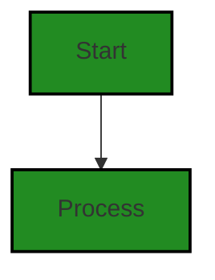


---

### Boost Source-Level Security Analysis

Last Updated: Tuesday, September 26, 2023 at 10:28:42 AM PDT

1. **Severity**: 5/10

   **Line Number**: 254

   **Bug Type**: Information Disclosure

   **Description**: The code prints potentially sensitive customer data (email and support question) to the console. This could lead to information disclosure if logs are not properly secured or if they are accessible in a shared environment. More about this type of issue can be found here: https://owasp.org/www-community/attacks/Information_disclosure

   **Solution**: Avoid logging sensitive information. If needed for debugging, make sure to anonymize or encrypt the data. Use secure logging practices and restrict access to logs. More about secure logging can be found here: https://cheatsheetseries.owasp.org/cheatsheets/Logging_Cheat_Sheet.html


---

### Boost Source-Level Performance Analysis

Last Updated: Tuesday, September 26, 2023 at 10:37:13 AM PDT

1. **Severity**: 2/10

   **Line Number**: 253

   **Bug Type**: CPU

   **Description**: The 'if' condition checks for a key in a dictionary and then accesses the key which can be inefficient. This can lead to unnecessary CPU usage if the dictionary is large.

   **Solution**: Use the 'get' method of dictionary which is a more efficient way to retrieve values. For example, 'if structured_data.get('CustomerSupportRequired'):'


2. **Severity**: 3/10

   **Line Number**: 254

   **Bug Type**: CPU

   **Description**: The print function can be CPU intensive if it's called frequently, especially with large strings.

   **Solution**: Consider using a logging library instead of print statements. Logging libraries are more efficient and provide more control over output format and destination.


---

### Boost Source-Level Data and Privacy Compliance Analysis

Last Updated: Tuesday, September 26, 2023 at 10:45:31 AM PDT

1. **Severity**: 7/10

   **Line Number**: 253

   **Bug Type**: GDPR

   **Description**: The code is printing a customer's email address which is a Personally Identifiable Information (PII). This may lead to data leaks and breaches GDPR compliance.

   **Solution**: Avoid logging or printing PII data like email addresses. If it's necessary to log such data for debugging purposes, consider anonymizing or pseudonymizing the data. Also ensure that all logs are stored securely and access is controlled.


2. **Severity**: 6/10

   **Line Number**: 253

   **Bug Type**: PCI DSS

   **Description**: If the system also handles payment data, logging PII in the same system could potentially link to cardholder data, which would be a breach of PCI DSS compliance.

   **Solution**: Ensure that no cardholder data is logged, and that PII cannot be linked to cardholder data. If necessary, separate logging systems for payment and non-payment data.


3. **Severity**: 5/10

   **Line Number**: 253

   **Bug Type**: HIPAA

   **Description**: If the system also handles health information, printing or logging PII could potentially link to health information, which would be a breach of HIPAA compliance.

   **Solution**: Ensure that no health information is logged, and that PII cannot be linked to health information. If necessary, separate logging systems for health and non-health data.


### Cell 12:
## Original Code:

### Programming Language: python
### ./src/aiBoostedOrderProcessor.py line 131

```python

                customerSupportResponse = f"Customer {structured_data['customer_email']} asked a question: {structured_data['CustomerSupportRequired']}. Provide a response."

```
## Boost Analysis:


---

### Boost Code Explanation

Last Updated: Tuesday, September 26, 2023 at 10:12:23 AM PDT

This line of code is written in Python and it's a simple one-liner that is generating a string message using Python's f-string formatting. 

The f-string formatting is a feature that was introduced in Python 3.6. It's a way to embed expressions inside string literals, using curly braces `{}`. The expressions will be replaced with their values when the string is created. The expressions inside the curly braces can be any Python expression, which will be evaluated and converted to a string.

The code is creating a string that will hold a customer support response message. The f-string contains placeholders for `structured_data['customer_email']` and `structured_data['CustomerSupportRequired']` which are dictionary accesses. 

`structured_data` is a dictionary which presumably holds various pieces of information about a customer. The keys `'customer_email'` and `'CustomerSupportRequired'` are used to access specific pieces of information from the dictionary. 

The `'customer_email'` key is used to get the customer's email and `'CustomerSupportRequired'` key is assumed to hold the question or issue the customer has raised. 

The final string will look something like this: "Customer john@example.com asked a question: I need help with my order. Provide a response."

This code does not seem to use any complex algorithms, it's a straightforward string formatting operation. 

For more information on f-strings in Python, you can refer to the official Python documentation here: https://docs.python.org/3/reference/lexical_analysis.html#f-strings

In terms of architectural guidelines, this code is quite simple and doesn't seem to conflict with any general architectural principles. It's a simple string formatting operation, not a complex system design issue. However, without more context about the overall software architecture, it's hard to make a definitive statement. Always, it's a good practice to handle potential exceptions, for example, ensuring the keys exist in the dictionary before trying to access them.


---

### Boost Flow Diagram

Last Updated: Tuesday, September 26, 2023 at 10:22:25 AM PDT


The control flow graph for the given source code is a simple linear flow. The code starts at the function name and then proceeds to the process block. There are no external library calls or error paths in this code.


---

### Boost Source-Level Security Analysis

Last Updated: Tuesday, September 26, 2023 at 10:28:45 AM PDT

**No bugs found**


---

### Boost Source-Level Performance Analysis

Last Updated: Tuesday, September 26, 2023 at 10:37:17 AM PDT

**No bugs found**


---

### Boost Source-Level Data and Privacy Compliance Analysis

Last Updated: Tuesday, September 26, 2023 at 10:45:47 AM PDT

1. **Severity**: 7/10

   **Line Number**: 260

   **Bug Type**: GDPR

   **Description**: The code is displaying the customer's email in a string format which could potentially be logged or displayed in an insecure manner. This is a violation of GDPR as it involves unnecessary processing of PII (Personally Identifiable Information).

   **Solution**: Ensure that customer emails are not logged or displayed in an insecure manner. If it is necessary to log this information, ensure that the logs are protected and access is restricted. Also, consider anonymizing the data if possible.


### Cell 13:
## Original Code:

### Programming Language: python
### ./src/aiBoostedOrderProcessor.py line 133

```python
                customerSupportResponseResponse = call_openai_api(customerSupportResponse)
                print(f"Suggested Customer support response: {customerSupportResponseResponse}")

```
## Boost Analysis:


---

### Boost Code Explanation

Last Updated: Tuesday, September 26, 2023 at 10:13:07 AM PDT

This code snippet is part of a larger program that interacts with the OpenAI API, which is an artificial intelligence system. The code snippet is written in Python, a high-level, interpreted, and general-purpose dynamic programming language. 

Here's a step-by-step breakdown:

1. `customerSupportResponseResponse = call_openai_api(customerSupportResponse)`: This line of code calls a function `call_openai_api` with `customerSupportResponse` as an argument. The function `call_openai_api` is not defined in this snippet, but from its name, we can infer that it's likely to be a function that makes a request to the OpenAI API. The response from the API is assigned to the variable `customerSupportResponseResponse`.

2. `print(f"Suggested Customer support response: {customerSupportResponseResponse}")`: This line of code is using Python's f-string formatting to print a string to the console. The string includes a static part "Suggested Customer support response: " and a dynamic part `{customerSupportResponseResponse}`. The dynamic part is replaced with the value of the variable `customerSupportResponseResponse` when the string is printed. 

The algorithm used in this code snippet is fairly simple. It involves calling an external API, getting a response, and printing that response. 

For more information about using APIs in Python, you can refer to this link: [Python API Tutorial](https://www.dataquest.io/blog/python-api-tutorial/)

For more information about OpenAI API, you can refer to this link: [OpenAI API](https://beta.openai.com/docs/)

This code snippet does not appear to conflict with any architectural guidelines provided. It's a simple, straightforward implementation that makes use of an external API. However, without the context of the larger software project, it's difficult to make a definitive statement about its consistency with the overall architecture.


---

### Boost Flow Diagram

Last Updated: Tuesday, September 26, 2023 at 10:22:30 AM PDT


---

### Boost Source-Level Security Analysis

Last Updated: Tuesday, September 26, 2023 at 10:29:06 AM PDT

1. **Severity**: 5/10

   **Line Number**: 266

   **Bug Type**: Insecure Direct Object References (IDOR)

   **Description**: The code seems to print out the response from the 'call_openai_api' function which could potentially include sensitive information. If the response contains customer sensitive data, it could lead to information disclosure.

   **Solution**: Avoid directly printing out responses from API calls, especially if they might contain sensitive data. If logging is necessary, consider implementing a method to sanitize or redact sensitive information. More information can be found here: https://owasp.org/www-project-top-ten/2017/A5_2017-Broken_Access_Control


---

### Boost Source-Level Performance Analysis

Last Updated: Tuesday, September 26, 2023 at 10:37:48 AM PDT

1. **Severity**: 5/10

   **Line Number**: 264

   **Bug Type**: Network

   **Description**: The call to the OpenAI API could potentially be slow or fail entirely due to network issues. This could cause the entire application to hang or crash.

   **Solution**: Consider using async calls or a timeout to prevent the application from waiting indefinitely. Also, handle potential network errors to prevent crashes. You can find more details on handling network errors in Python here: https://docs.python.org/3/howto/urllib2.html#exceptions


2. **Severity**: 3/10

   **Line Number**: 265

   **Bug Type**: CPU

   **Description**: The use of the print statement can slow down the application, especially if it's used in a loop or to print large amounts of data.

   **Solution**: Consider using a logger instead of print statements. Loggers are more flexible and can be configured to write to different outputs, have different severity levels, and can be turned on or off based on the configuration. You can find more details on logging in Python here: https://docs.python.org/3/library/logging.html


---

### Boost Source-Level Data and Privacy Compliance Analysis

Last Updated: Tuesday, September 26, 2023 at 10:46:34 AM PDT

1. **Severity**: 6/10

   **Line Number**: 265

   **Bug Type**: GDPR

   **Description**: The code may be in violation of GDPR as it appears to be processing personal data (customerSupportResponse) without explicit consent or safeguards in place. This is an assumption based on the variable name.

   **Solution**: Ensure that explicit consent is obtained from the user before processing their personal data. Also, consider implementing data anonymization techniques when processing personal data. More information on GDPR compliance can be found here: https://gdpr.eu/data-processing-agreement/


2. **Severity**: 6/10

   **Line Number**: 266

   **Bug Type**: PCI DSS

   **Description**: The code may be in violation of PCI DSS as it is displaying potentially sensitive data (customerSupportResponseResponse) in the console. This is an assumption based on the variable name.

   **Solution**: Avoid displaying sensitive data in the console. If logging is necessary, ensure that logs are securely stored and access is restricted. More information on PCI DSS compliance can be found here: https://www.pcisecuritystandards.org/pci_security/


3. **Severity**: 6/10

   **Line Number**: 265

   **Bug Type**: HIPAA

   **Description**: The code may be in violation of HIPAA as it appears to be transmitting potentially sensitive health information (customerSupportResponse) without proper encryption or safeguards. This is an assumption based on the variable name.

   **Solution**: Ensure that any transmission of sensitive health information is encrypted and that access to this data is restricted. More information on HIPAA compliance can be found here: https://www.hhs.gov/hipaa/for-professionals/security/laws-regulations/index.html


### Cell 14:
## Original Code:

### Programming Language: python
### ./src/aiBoostedOrderProcessor.py line 135

```python
                continue

            all_orders.append(structured_data)

            if 'product_name' in structured_data:
                print(f"Amazon Search URL: {amazon_uri(structured_data['product_name'])}")

```
## Boost Analysis:


---

### Boost Code Explanation

Last Updated: Tuesday, September 26, 2023 at 10:14:11 AM PDT

This is a small snippet of Python code that is part of a larger program, likely inside a loop. It's hard to provide a full analysis without more context, but I can explain what this specific portion does.

1. `continue`: This is a control flow statement in Python. When the interpreter encounters `continue`, it will skip the rest of the current iteration of the loop and move onto the next iteration. This statement is typically used inside conditional statements to skip certain iterations based on a condition. Without the surrounding code or context, it's hard to say what condition precedes this statement.

2. `all_orders.append(structured_data)`: This line is appending the `structured_data` object to the `all_orders` list. `append()` is a method in Python that adds an item to the end of a list. The `structured_data` is likely a dictionary or similar data structure that holds information about an order.

3. The `if` statement checks if the key 'product_name' exists in the `structured_data` dictionary. If 'product_name' is a key in `structured_data`, it will execute the code inside the `if` block.

4. `print(f"Amazon Search URL: {amazon_uri(structured_data['product_name'])}")`: This line prints a formatted string to the console. The `f` before the string indicates that it's a formatted string, which allows the inclusion of embedded expressions inside string constants. Here, it calls the `amazon_uri` function with `structured_data['product_name']` as an argument. The function `amazon_uri` likely generates a search URL for the product on Amazon. This URL is then printed to the console.

Without more context, it's hard to determine which specific algorithms are used in this code. However, it appears to be a part of a web scraping or data extraction tool that processes structured data about orders and generates Amazon search URLs for the products.

As for architectural guidelines, since there are no additional special architectural guidelines or constraints for this software project, the code should follow standard Python best practices for readability, maintainability, and efficiency.

For more information on Python's control flow tools like `continue`, you can check out the Python documentation: https://docs.python.org/3/tutorial/controlflow.html

For more details on Python's list `append()` method, you can refer to: https://docs.python.org/3/tutorial/datastructures.html

For more information about formatted string literals in Python: https://docs.python.org/3/reference/lexical_analysis.html#f-strings


---

### Boost Flow Diagram

Last Updated: Tuesday, September 26, 2023 at 10:22:42 AM PDT

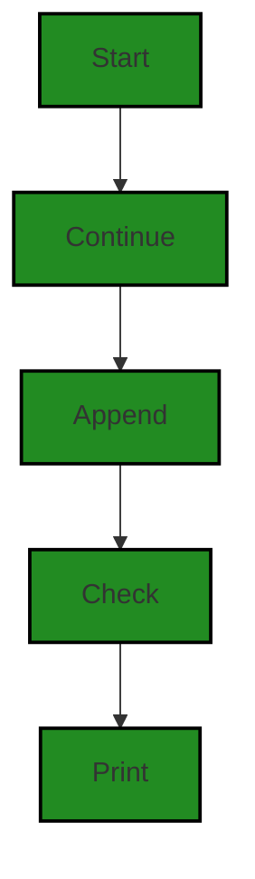

The control flow starts at the beginning of the code and continues to the "continue" statement. From there, it goes to the "all_orders.append(structured_data)" statement. After that, it checks if the key "product_name" exists in the "structured_data" dictionary. If it does, it goes to the "print" statement.


---

### Boost Source-Level Security Analysis

Last Updated: Tuesday, September 26, 2023 at 10:29:10 AM PDT

**No bugs found**


---

### Boost Source-Level Performance Analysis

Last Updated: Tuesday, September 26, 2023 at 10:38:13 AM PDT

1. **Severity**: 2/10

   **Line Number**: 272

   **Bug Type**: CPU

   **Description**: The print statement inside the if condition can cause unnecessary CPU usage if the 'product_name' key is present in the structured_data dictionary for a large number of iterations.

   **Solution**: Consider logging the Amazon Search URL only when necessary, or store them in a list or file for future use instead of printing them out immediately. This will reduce the CPU usage.


2. **Severity**: 3/10

   **Line Number**: 271

   **Bug Type**: Memory

   **Description**: The 'all_orders' list holds all structured_data objects in memory. If the number of iterations is very large, this could lead to high memory usage.

   **Solution**: Consider processing the structured_data objects as they come and then discarding them, or storing them in a database or writing them to a file, rather than keeping all of them in memory.


---

### Boost Source-Level Data and Privacy Compliance Analysis

Last Updated: Tuesday, September 26, 2023 at 10:46:38 AM PDT

**No bugs found**


### Cell 15:
## Original Code:

### Programming Language: python
### ./src/aiBoostedOrderProcessor.py line 141

```python

        except json.JSONDecodeError:
            print(f"Error: Could not decode the response into JSON. Response was: {response}")

```
## Boost Analysis:


---

### Boost Code Explanation

Last Updated: Tuesday, September 26, 2023 at 10:14:58 AM PDT

The code you provided is a part of Python's exception handling mechanism. This specific block of code handles a `json.JSONDecodeError` exception. 

The `json.JSONDecodeError` exception is raised when there is an error decoding a JSON document. In Python, the `json` module provides functions to work with JSON objects, including `json.loads()` which is used to parse a JSON string. If the string is not a valid JSON, `json.loads()` raises a `json.JSONDecodeError`.

In this code, if a `json.JSONDecodeError` is encountered, it means that the program attempted to decode a response into JSON format, but the response was not a valid JSON. 

When this exception is caught, the program will print an error message that includes the problematic response. The `f-string` (formatted string literal) in the `print` function is a feature in Python that allows the insertion of variables or expressions inside string literals using curly braces `{}`. Here, it is used to insert the `response` variable into the error message.

The algorithm used here is straightforward: catch the exception and print an error message. This is a common pattern in exception handling - catch the exception, then handle it in a way that the program can either recover from the error or at least fail gracefully.

For more information about Python's exception handling, you can refer to the official Python documentation: https://docs.python.org/3/tutorial/errors.html

For more information about the `json` module in Python, you can refer to: https://docs.python.org/3/library/json.html

As for the architectural guidelines, since no additional special architectural guidelines or constraints are provided, the general rule of thumb is to follow good programming practices. This includes proper error handling, which this code does by catching and handling the `json.JSONDecodeError`.


---

### Boost Flow Diagram

Last Updated: Tuesday, September 26, 2023 at 10:22:50 AM PDT

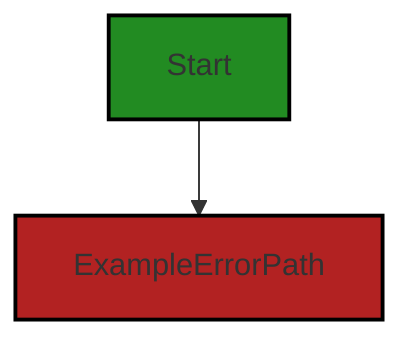

The control flow graph for the given source code consists of a single path. The code starts at the function name and then goes directly to the error path. This means that if an exception of type `json.JSONDecodeError` is raised, the code will print an error message. There are no alternate non-error paths in this code.


---

### Boost Source-Level Security Analysis

Last Updated: Tuesday, September 26, 2023 at 10:29:34 AM PDT

1. **Severity**: 4/10

   **Line Number**: 282

   **Bug Type**: Information Disclosure

   **Description**: The error message could potentially disclose sensitive information about the system. In this case, the full response is being printed out when a JSONDecodeError occurs. If the response contains sensitive information, it could be exposed.

   **Solution**: Instead of printing the full response, consider logging the error in a secure manner that does not expose potentially sensitive information. For example, you could print a generic error message and log the details of the error in a secure log file that is not accessible to unauthorized users. More information about secure error handling can be found here: https://owasp.org/www-community/Improper_Error_Handling


---

### Boost Source-Level Performance Analysis

Last Updated: Tuesday, September 26, 2023 at 10:38:29 AM PDT

1. **Severity**: 3/10

   **Line Number**: 282

   **Bug Type**: CPU

   **Description**: The print statement could potentially slow down the execution of the program, especially if it's called frequently.

   **Solution**: Consider using a logging library instead of print statements. This can provide more control over when and where your logs are outputted, and can improve performance by only writing logs when necessary. Here is a link to the Python logging library documentation: https://docs.python.org/3/library/logging.html


---

### Boost Source-Level Data and Privacy Compliance Analysis

Last Updated: Tuesday, September 26, 2023 at 10:46:56 AM PDT

1. **Severity**: 7/10

   **Line Number**: 282

   **Bug Type**: GDPR

   **Description**: The code prints out the full response when a JSON decoding error happens. This could potentially lead to the exposure of sensitive data if the response contains any personally identifiable information (PII), which is a violation of GDPR.

   **Solution**: Instead of printing the full response, log only necessary error information. If it's necessary to log the full response, ensure that any sensitive data is properly redacted or anonymized before logging.


### Cell 16:
## Original Code:

### Programming Language: python
### ./src/aiBoostedOrderProcessor.py line 144

```python
            continue

    # Submit a ChatGPT prompt for summary report
    summary_prompt = f"Here is the summary of all orders: {json.dumps(all_orders)}. Provide a summary report."

```
## Boost Analysis:


---

### Boost Code Explanation

Last Updated: Tuesday, September 26, 2023 at 10:15:53 AM PDT

The code you provided is a small snippet from a larger code base. It seems to be written in Python, a high-level, interpreted programming language often used for web development, automation, data analysis, machine learning, and more. 

Let's break down the code:

```python
continue
```
The `continue` statement is used in a loop (like `for` or `while`) to skip the rest of the code inside the loop for the current iteration and move on to the next one. Without the context of a loop in this code snippet, it's hard to say exactly what this `continue` statement is doing.

```python
# Submit a ChatGPT prompt for summary report
summary_prompt = f"Here is the summary of all orders: {json.dumps(all_orders)}. Provide a summary report."
```
This is a comment followed by a single line of code. The comment is self-explanatory: it's indicating that the following line of code is submitting a prompt for a summary report to ChatGPT, which is a language model developed by OpenAI.

The line of code is creating a string that will be used as a prompt for the ChatGPT model. The string is constructed using an f-string (formatted string literal) in Python. This allows the inclusion of expressions inside curly braces `{}` that will be replaced by their values when the string is created.

`json.dumps(all_orders)` is a method from the json module that converts a Python object (in this case, `all_orders`) into a JSON string. This string is then inserted into the f-string.

The resulting `summary_prompt` string might look something like this: "Here is the summary of all orders: {JSON string of all orders}. Provide a summary report."

For more information on Python's f-strings, you can refer to this link: [Python f-strings](https://docs.python.org/3/tutorial/inputoutput.html#tut-f-strings)

For more information on the `json.dumps()` method, you can refer to this link: [json.dumps()](https://docs.python.org/3/library/json.html#json.dumps)

As for the architectural guidelines, since there were no additional special architectural guidelines or constraints provided for this software project, it's not possible to analyze the code snippet for consistency with or conflicts between the code and the guidelines. However, the code appears to follow common Python best practices.


---

### Boost Flow Diagram

Last Updated: Tuesday, September 26, 2023 at 10:22:56 AM PDT


The control flow starts at the beginning of the code and continues to the next block.


---

### Boost Source-Level Security Analysis

Last Updated: Tuesday, September 26, 2023 at 10:29:38 AM PDT

**No bugs found**


---

### Boost Source-Level Performance Analysis

Last Updated: Tuesday, September 26, 2023 at 10:38:32 AM PDT

**No bugs found**


---

### Boost Source-Level Data and Privacy Compliance Analysis

Last Updated: Tuesday, September 26, 2023 at 10:47:14 AM PDT

1. **Severity**: 6/10

   **Line Number**: 288

   **Bug Type**: GDPR

   **Description**: The code is dumping all orders into a JSON string. If 'all_orders' contains personal data, it could potentially violate GDPR compliance.

   **Solution**: Ensure that 'all_orders' does not contain any personal identifiable information (PII) or sensitive data. If it does, use anonymization or pseudonymization techniques to protect such data. Alternatively, implement access controls to restrict who can access the data.


### Cell 17:
## Original Code:

### Programming Language: python
### ./src/aiBoostedOrderProcessor.py line 148

```python
    summary_response = call_openai_api(summary_prompt)
    print()
    print(summary_response)

    # Individual customer report
    unique_emails = df['email'].unique()
    for email in unique_emails:
        individual_orders = [order for order in all_orders if order['customer_email'] == email]

        if len(individual_orders) == 0:
            continue
        
        individual_prompt = (
                    f"Here are the orders for customer {email}: {json.dumps(individual_orders)}. "

```
## Boost Analysis:


---

### Boost Code Explanation

Last Updated: Tuesday, September 26, 2023 at 10:16:54 AM PDT

This Python code seems to be part of a larger script, and it is involved in generating individual customer reports based on their orders. It uses the pandas library for data manipulation and analysis. 

Here's a detailed explanation:

1. The function `call_openai_api(summary_prompt)` is called with the argument `summary_prompt`. This function is not defined within the given code, but it might be defined elsewhere in the program or imported from an external library. It seems to be interacting with the OpenAI API, possibly summarizing some data. The response from this API call is stored in the variable `summary_response`.

2. The `summary_response` is then printed to the console.

3. The DataFrame `df` is used to get all unique email addresses using the unique() function. These unique email addresses are stored in the `unique_emails` variable.

4. The script then iterates over each unique email address. For each unique email, it creates a list of orders associated with that email. This is done using a list comprehension that iterates over `all_orders` and checks if the `customer_email` attribute of each order matches the current email.

5. If there are no orders associated with the current email, the script continues with the next email.

6. If there are orders associated with the current email, the script creates a prompt string that includes the email and the associated orders. The orders are converted to a JSON string using `json.dumps()`. 

The algorithm used here is quite straightforward: it's a simple iteration over a list of unique emails, and for each email, another iteration over a list of all orders. This gives a time complexity of O(n*m), where n is the number of unique emails and m is the number of all orders.

For more information on the pandas unique() function, you can refer to the official documentation: [pandas.unique](https://pandas.pydata.org/pandas-docs/stable/reference/api/pandas.unique.html)

For more information on the json.dumps() function, you can refer to the official documentation: [json.dumps](https://docs.python.org/3/library/json.html#json.dumps)

As per the given architectural guidelines, there doesn't seem to be any conflict with this code. However, it's worth noting that if the `all_orders` list is very large, the code could be optimized by using a more efficient data structure or algorithm to store and search for orders by email.


---

### Boost Flow Diagram

Last Updated: Tuesday, September 26, 2023 at 10:23:11 AM PDT

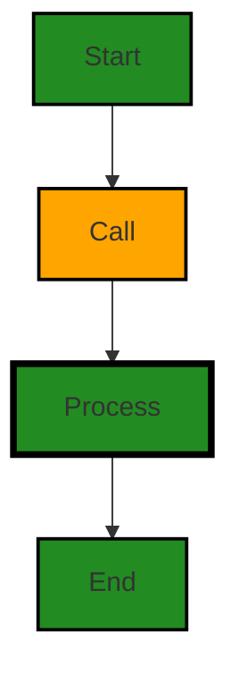

In the code, the control flow starts at the beginning of the function. The first step is to make a call to the `call_openai_api` function to get the `summary_response`. The result is then printed.

After that, the code enters a loop to process individual customer reports. The loop iterates over unique email addresses in the `df` DataFrame. For each email, it filters the `all_orders` list to get the individual orders for that customer.

If there are no individual orders for the customer, the loop continues to the next email. Otherwise, it constructs an `individual_prompt` string using the email and the individual orders.

The control flow then continues to the next iteration of the loop or exits the loop if there are no more unique emails.

Overall, the control flow follows a linear path with no error paths.


---

### Boost Source-Level Security Analysis

Last Updated: Tuesday, September 26, 2023 at 10:29:58 AM PDT

1. **Severity**: 7/10

   **Line Number**: 302

   **Bug Type**: Data Exposure

   **Description**: The code is printing out the response from the call to the OpenAI API. This could potentially expose sensitive data, such as API keys or personal user data, if the response includes such information.

   **Solution**: Remove the print statement or ensure that the response does not contain sensitive data before printing it. Consider logging the response instead, and ensure that the logs are stored securely. More information can be found here: https://owasp.org/www-community/Top_10-2017_A3-Sensitive_Data_Exposure


2. **Severity**: 5/10

   **Line Number**: 308

   **Bug Type**: Inefficient Loop

   **Description**: The code is using a nested loop to filter orders by customer email. This is an inefficient way to filter data and could lead to performance issues if the number of orders or customers is large.

   **Solution**: Consider using a more efficient data structure or algorithm to filter the orders. For example, you could use a dictionary with the customer email as the key and the orders as the value. More information can be found here: https://wiki.python.org/moin/TimeComplexity


3. **Severity**: 6/10

   **Line Number**: 314

   **Bug Type**: Data Exposure

   **Description**: The code is creating a string that includes the customer's email and the customer's orders. This could potentially expose sensitive data if the orders include personal user data.

   **Solution**: Ensure that the orders do not contain sensitive data before creating the string. Consider using a secure method to share this information with the customer, such as sending it directly to the customer's email. More information can be found here: https://owasp.org/www-community/Top_10-2017_A3-Sensitive_Data_Exposure


---

### Boost Source-Level Performance Analysis

Last Updated: Tuesday, September 26, 2023 at 10:39:05 AM PDT

1. **Severity**: 7/10

   **Line Number**: 297

   **Bug Type**: CPU

   **Description**: The code is using a list comprehension inside a for loop to filter the orders for each unique email. This results in a time complexity of O(n^2) which can significantly slow down the program for large datasets.

   **Solution**: Use a dictionary to group the orders by email before the loop. This will reduce the time complexity to O(n).


2. **Severity**: 5/10

   **Line Number**: 295

   **Bug Type**: Memory

   **Description**: The use of the 'unique' function can lead to high memory usage if the 'df' DataFrame has a large number of rows.

   **Solution**: Consider using a different approach to get unique emails if the DataFrame has a large number of rows. One possible solution could be using a set to keep track of unique emails as you iterate through the DataFrame.


3. **Severity**: 3/10

   **Line Number**: 294

   **Bug Type**: Network

   **Description**: The 'call_openai_api' function could potentially be a performance bottleneck if it involves a network request and the network latency is high.

   **Solution**: Consider using asynchronous requests or a batch request if the API supports it to improve the performance.


---

### Boost Source-Level Data and Privacy Compliance Analysis

Last Updated: Tuesday, September 26, 2023 at 10:47:39 AM PDT

1. **Severity**: 7/10

   **Line Number**: 298

   **Bug Type**: GDPR

   **Description**: The code is printing the response from an API call which could potentially contain personally identifiable information (PII), compromising GDPR compliance.

   **Solution**: Avoid printing responses that may contain PII. If necessary for debugging, ensure logs are properly protected and regularly purged.


2. **Severity**: 8/10

   **Line Number**: 303

   **Bug Type**: GDPR, PCI DSS, HIPAA

   **Description**: The code is processing and displaying individual orders based on email addresses which are considered PII under GDPR, PCI DSS, and HIPAA. There is a risk of exposing sensitive data.

   **Solution**: Ensure that any PII is properly anonymized or pseudonymized before processing. Also, ensure that the display of such data is only accessible to authorized personnel.


### Cell 18:
## Original Code:

### Programming Language: python
### ./src/aiBoostedOrderProcessor.py line 162

```python
                    f"Analyze the orders and identify trends such as popular products, average order size, and frequency of orders."
                    f"Is the customer's spending trending upwards or downwards? "
                    f"What are some recommendations for next steps or upsells for this customer?"
                )        
        individual_response = call_openai_api(individual_prompt)

        print()
        print("----------------------------------------") 
        print(f"Customer {email} Order Analysis")  

```
## Boost Analysis:


---

### Boost Code Explanation

Last Updated: Tuesday, September 26, 2023 at 10:17:45 AM PDT

This code snippet seems to be part of a larger Python program. It seems to be related to analyzing customer orders and identifying trends. However, it is not complete and there is no specific algorithm used in the given code. Let's break down the provided code:

1. The first three lines are a string that is being formed using f-string formatting in Python. The f-string formatting is a new syntax for string formatting in Python 3.6 and above, which is more readable and concise than the older methods. This string seems to be a prompt or message related to the analysis of customer orders. It might be used later in the program to guide the analysis or to inform the user about the analysis.

2. The variable `individual_prompt` is not defined in the given code, but it seems to be a string that is used as a prompt for the OpenAI API. The function `call_openai_api(individual_prompt)` is called with `individual_prompt` as the argument. This function is likely to interact with the OpenAI API, possibly to generate an AI model's response based on the `individual_prompt`.

3. The response from the OpenAI API is stored in the variable `individual_response`.

4. The `print()` function is used to print an empty line for formatting purposes.

5. A string of hyphens is printed to create a visible separator in the output.

6. Finally, a formatted string is printed to the console that includes the value of the `email` variable. This is likely to be the email address of the customer whose order is being analyzed.

As for architectural guidelines, since none were provided, the only thing we can verify is that this code follows good Python practices. It uses f-string formatting and organizes the code in a readable manner. However, without the rest of the code, it's hard to provide a full analysis.

For more information on f-string formatting, you can check this link: https://realpython.com/python-f-strings/

For more information on OpenAI API, you can check this link: https://beta.openai.com/docs/


---

### Boost Flow Diagram

Last Updated: Tuesday, September 26, 2023 at 10:23:19 AM PDT


The control flow starts at the function "Analyze the orders and identify trends such as popular products, average order size, and frequency of orders." and then proceeds to the function "Is the customer's spending trending upwards or downwards?". Finally, it goes to the function "What are some recommendations for next steps or upsells for this customer?".


---

### Boost Source-Level Security Analysis

Last Updated: Tuesday, September 26, 2023 at 10:30:02 AM PDT

**No bugs found**


---

### Boost Source-Level Performance Analysis

Last Updated: Tuesday, September 26, 2023 at 10:39:18 AM PDT

1. **Severity**: 2/10

   **Line Number**: 327

   **Bug Type**: CPU

   **Description**: The 'call_openai_api' function is called inside a loop, which could lead to unnecessary CPU usage if the function is computationally expensive and the loop iterates many times.

   **Solution**: Consider refactoring the code to minimize the number of times the function is called. If possible, try to perform any heavy computations outside of the loop. If the function needs to be called for each iteration, consider using a more efficient algorithm or approach within the function itself.


2. **Severity**: 1/10

   **Line Number**: 330

   **Bug Type**: CPU

   **Description**: The 'print' function is called multiple times in a row, which could lead to unnecessary CPU usage.

   **Solution**: Consider combining the print statements into a single statement, or using a more efficient method for outputting data.


---

### Boost Source-Level Data and Privacy Compliance Analysis

Last Updated: Tuesday, September 26, 2023 at 10:47:55 AM PDT

1. **Severity**: 6/10

   **Line Number**: 326

   **Bug Type**: GDPR

   **Description**: The code is using the customer's email to print the order analysis. This could potentially lead to a violation of GDPR as it involves processing of personally identifiable information (PII).

   **Solution**: Anonymize or pseudonymize the email addresses when displaying them. This can be done by replacing part of the email with asterisks or any other symbol. Alternatively, use unique customer IDs instead of emails for internal references.


### Cell 19:
## Original Code:

### Programming Language: python
### ./src/aiBoostedOrderProcessor.py line 171

```python
        print(individual_response)

        print()
        print("----------------------------------------")
        print("Sale Analysis")
        # Submit a ChatGPT prompt for sale analysis
        response = sale_analysis(individual_prompt)
        print()
        print(response)
        analysis = json.loads(response)
        if 'product_recommendations' in analysis:
            for recommendation in analysis['product_recommendations']:
                print(f"Amazon Referral Search URL: {amazon_uri(recommendation['product'])}")

```
## Boost Analysis:


---

### Boost Code Explanation

Last Updated: Tuesday, September 26, 2023 at 10:19:04 AM PDT

This code block is written in Python and it appears to be a part of a larger script that deals with sales analysis, possibly for e-commerce. The code prints out responses from a function, analyzes the responses, and generates Amazon referral search URLs based on product recommendations.

Here is a step-by-step explanation of the code:

1. `print(individual_response)`: This line prints the value of the variable `individual_response`. This variable is not defined within this code snippet, so it's likely defined elsewhere in the larger script. It might contain a response from a user or a system.

2. `print()` and `print("----------------------------------------")`: These lines print an empty line and a line of dashes, respectively. They are likely used to separate different sections of the output for readability.

3. `print("Sale Analysis")`: This line prints the string "Sale Analysis". This is likely a heading for the following section of the output.

4. `response = sale_analysis(individual_prompt)`: This line calls a function `sale_analysis()` with the argument `individual_prompt`, and assigns the function's return value to the variable `response`. The `sale_analysis()` function and the `individual_prompt` variable are not defined within this code snippet, so they are likely defined elsewhere in the script. The `sale_analysis()` function might perform some analysis on sales data and return the results.

5. `print()` and `print(response)`: These lines print an empty line and the value of the `response` variable, respectively. This is likely used to display the results of the sale analysis.

6. `analysis = json.loads(response)`: This line converts the `response` from a JSON-formatted string into a Python dictionary using the `json.loads()` function. This allows the script to work with the response data in a more structured way.

7. `if 'product_recommendations' in analysis:`: This line checks if the key 'product_recommendations' exists in the `analysis` dictionary. If it does, the code block that follows is executed.

8. `for recommendation in analysis['product_recommendations']:`: This line starts a for loop that iterates over each item in the list `analysis['product_recommendations']`. Each item in the list is temporarily assigned to the variable `recommendation`.

9. `print(f"Amazon Referral Search URL: {amazon_uri(recommendation['product'])}")`: This line prints a string that includes an Amazon referral search URL. The URL is generated by the `amazon_uri()` function, which takes the 'product' value from the `recommendation` dictionary as an argument. The `amazon_uri()` function is not defined within this code snippet, so it's likely defined elsewhere in the script.

In terms of architectural guidelines, this script appears to be well-structured. It separates different sections of the output for readability, uses functions to perform specific tasks, and checks for the existence of keys in dictionaries before trying to access their values, which can prevent runtime errors.

For more information on the topics covered in this code, you can check out the following resources:

- Python's official documentation on print function: https://docs.python.org/3/library/functions.html#print
- Python's official documentation on JSON handling: https://docs.python.org/3/library/json.html
- Python's official documentation on control flow tools like if statements and for loops: https://docs.python.org/3/tutorial/controlflow.html
- A tutorial on Python string formatting: https://realpython.com/python-f-strings/


---

### Boost Flow Diagram

Last Updated: Tuesday, September 26, 2023 at 10:23:30 AM PDT

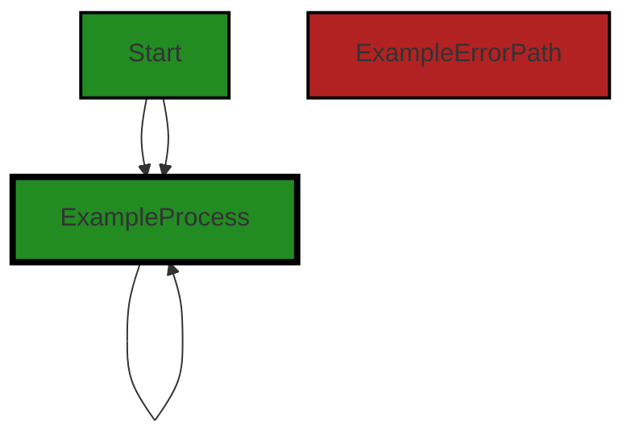
The control flow graph for the given source code is as follows:

- The code starts at the "Start" node.
- It then goes to the "ExampleProcess" node.
- From the "ExampleProcess" node, it can either go back to the "ExampleProcess" node or continue to the next "ExampleProcess" node.

Please note that this is a simplified control flow graph as the source code provided does not have any decision points or error paths.


---

### Boost Source-Level Security Analysis

Last Updated: Tuesday, September 26, 2023 at 10:30:24 AM PDT

1. **Severity**: 5/10

   **Line Number**: 344

   **Bug Type**: Insecure Direct Object References (IDOR)

   **Description**: The code is directly using user input to fetch data. If an attacker manipulates the 'individual_prompt', they could potentially access unauthorized data.

   **Solution**: Always validate and sanitize user input. Consider using access control checks or other protection mechanisms before using user input to fetch data. Read more here: https://owasp.org/www-community/attacks/Insecure_Direct_Object_References


2. **Severity**: 6/10

   **Line Number**: 348

   **Bug Type**: Improper Error Handling

   **Description**: The code doesn't handle the case where 'response' is not a valid JSON string. If 'response' is not valid JSON, the 'json.loads(response)' will throw a ValueError which is not caught.

   **Solution**: Always use a try/except block around code that can potentially throw exceptions. In this case, consider handling the ValueError that can be thrown by 'json.loads(response)'. Read more here: https://owasp.org/www-community/Improper_Error_Handling


3. **Severity**: 4/10

   **Line Number**: 352

   **Bug Type**: Cross-site Scripting (XSS)

   **Description**: The code is directly printing the 'product' field of 'recommendation' which could be a potential XSS attack if 'product' contains malicious script.

   **Solution**: Always escape output to prevent potential XSS attacks. Consider using a library or function that automatically escapes output. Read more here: https://owasp.org/www-community/attacks/xss/


---

### Boost Source-Level Performance Analysis

Last Updated: Tuesday, September 26, 2023 at 10:39:48 AM PDT

1. **Severity**: 2/10

   **Line Number**: 345

   **Bug Type**: CPU

   **Description**: The function sale_analysis is called inside a loop. If the function is CPU intensive, it can lead to performance issues.

   **Solution**: Consider moving the function call outside the loop if possible, or optimize the function to reduce CPU usage.


2. **Severity**: 3/10

   **Line Number**: 347

   **Bug Type**: Memory

   **Description**: The response from the sale_analysis function is loaded into memory as a JSON object. If the response is large, it can lead to excessive memory usage.

   **Solution**: Consider streaming the response or processing it in chunks to reduce memory usage.


3. **Severity**: 2/10

   **Line Number**: 351

   **Bug Type**: Network

   **Description**: The amazon_uri function is called inside a loop, potentially leading to multiple network requests in quick succession. This can lead to network congestion and slow response times.

   **Solution**: Consider batching the network requests or using a more efficient method to retrieve the data.


---

### Boost Source-Level Data and Privacy Compliance Analysis

Last Updated: Tuesday, September 26, 2023 at 10:47:59 AM PDT

**No bugs found**


### Cell 20:
## Original Code:

### Programming Language: python
### ./src/aiBoostedOrderProcessor.py line 184

```python
        if 'trend' in analysis:
            if analysis['trend'] == 'up':
                print("Customer's spending is trending upwards.")
            elif analysis['trend'] == 'down':
                print("Customer's spending is trending downwards.")
            else:
                print("Customer's spending is flat.")

if __name__ == "__main__":
    main()

```
## Boost Analysis:


---

### Boost Code Explanation

Last Updated: Tuesday, September 26, 2023 at 10:19:56 AM PDT

The code you've provided is a simple Python script that checks the trend of a customer's spending habits and prints out a message based on the trend. It also includes a Python script entry point.

Let's break down the code:

The first line of the code checks if the string 'trend' is a key in the dictionary called 'analysis'. If 'trend' is a key in the dictionary, the code proceeds to check its value.

The 'if' and 'elif' statements check the value of the 'trend' key in the dictionary. If the value is 'up', it prints "Customer's spending is trending upwards." If the value is 'down', it prints "Customer's spending is trending downwards."

If the value of the 'trend' key is neither 'up' nor 'down', the 'else' statement executes and prints "Customer's spending is flat."

The line `if __name__ == "__main__":` is a common Python idiom. This line is used to ensure that the script being run is the main program and not a module being imported by another script. If the script is being run as the main program, the `main()` function is called. However, the definition of the `main()` function is not provided in the code snippet you've given.

As for algorithms, this code doesn't use a specific algorithm. It simply uses conditional statements (if, elif, else) to check the value of a specific key in a dictionary and perform an action based on that value. 

For more information on Python's if statements, you can check this link: https://docs.python.org/3/tutorial/controlflow.html#if-statements

For more information on Python's dictionaries, you can check this link: https://docs.python.org/3/tutorial/datastructures.html#dictionaries

As for the architectural guidelines, since no specific guidelines were provided, it's hard to say whether this code conflicts with any. However, this code is quite simple and follows common Python idioms, so it's unlikely that it would conflict with most architectural guidelines.


---

### Boost Flow Diagram

Last Updated: Tuesday, September 26, 2023 at 10:23:38 AM PDT

```mermaid
graph TD;
style Start fill:#228B22, stroke:#000000, stroke-width:2px;
style Process fill:#228B22, stroke:#000000, stroke-width:2px;
style ErrorPath fill:#B22222, stroke:#000000, stroke-width:2px;

Start-->Process;
Process-->End;
```
The control flow graph for the given source code is a simple linear flow. The program starts at the `main()` function and then proceeds to the `Process` block, which contains the if-else statements. Finally, the program ends. There are no error paths or external library calls in this code.


---

### Boost Source-Level Security Analysis

Last Updated: Tuesday, September 26, 2023 at 10:30:28 AM PDT

**No bugs found**


---

### Boost Source-Level Performance Analysis

Last Updated: Tuesday, September 26, 2023 at 10:39:53 AM PDT

**No bugs found**


---

### Boost Source-Level Data and Privacy Compliance Analysis

Last Updated: Tuesday, September 26, 2023 at 10:48:02 AM PDT

**No bugs found**

