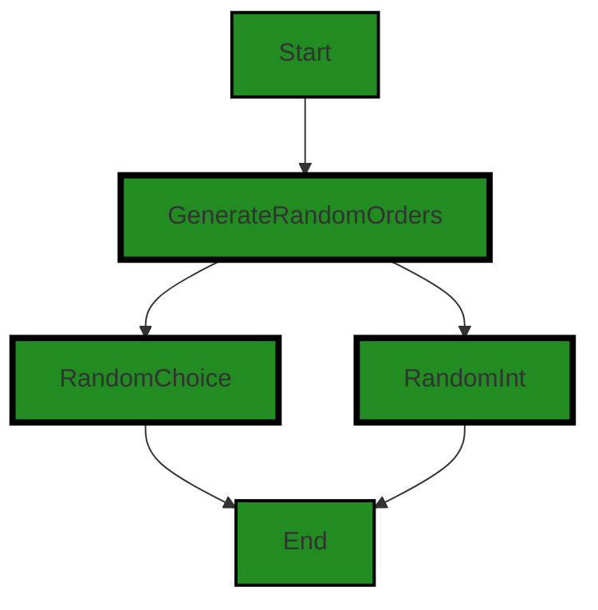
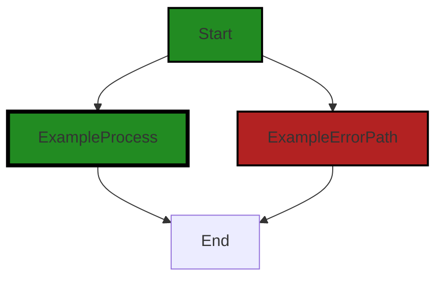

# Polyverse Boost-generated Source Analysis Details

## Source: ./src/createTestOrderRequests.py
Date Generated: Tuesday, September 26, 2023 at 10:57:36 AM PDT


---

### Boost Architectural Quick Summary Security Report

Last Updated: Tuesday, September 26, 2023 at 10:54:32 AM PDT


Executive Report:

1. **Architectural Impact**: The analysis of this file has not revealed any severe issues.
2. **Risk Analysis**: The analysis of this file has not revealed any severe issues.
3. **Potential Customer Impact**: Based on the analysis, there are no severe issues that could potentially impact customers.
4. **Performance Issues**: Our analysis did not identify any explicit performance issues in the file.
5. **Risk Assessment**: Based on the current analysis of this file, no severe issues have been found. However, this doesn't guarantee that the file is risk-free.

Highlights:

- No severe issues were identified in the current analysis of this file.


---

### Boost Architectural Quick Summary Performance Report

Last Updated: Tuesday, September 26, 2023 at 10:56:32 AM PDT

**Executive Summary:**

The software project under review consists of a single Python file, `src/createTestOrderRequests.py`. The analysis has identified a few issues of varying severity, with the most severe being related to memory usage. 

**Architectural Impact:**

The architecture of the software project is relatively simple, given that it consists of a single Python file. The identified issues do not appear to have a significant architectural impact. However, the memory usage issue could potentially impact the scalability of the software, particularly if the list of orders processed by the software grows significantly.

**Risk Analysis:**

The risk associated with the identified issues is moderate. The memory usage issue could potentially lead to performance degradation or even system crashes if not addressed. However, given that this issue was identified in a single file, the overall risk to the project is relatively low.

**Potential Customer Impact:**

Customers could potentially experience slower performance or system instability due to the memory usage issue. This could impact their user experience and overall satisfaction with the software.

**Overall Issues:**

The overall health of the source code is relatively good, with only a few issues identified. However, the memory usage issue should be addressed to ensure the software can scale effectively.

**Risk Assessment:**

Given that the project consists of a single file, 100% of the project files have issues. However, none of the issues identified have a severity of 7 or higher.

**Root Cause Analysis:**

The memory usage issue appears to be due to a lack of developer education regarding efficient data structures and methods for storing and processing large amounts of data.

**Recommended Actions:**

1. Provide training to developers on efficient data structures and methods for storing and processing large amounts of data.
2. Refactor the `src/createTestOrderRequests.py` file to use a more memory-efficient data structure or method for storing and processing orders.

**Highlights:**

- The most severe issue identified is related to memory usage in the `src/createTestOrderRequests.py` file.
- This issue could potentially impact the scalability of the software and the user experience.
- The root cause of this issue appears to be a lack of developer education regarding efficient data structures and methods.
- Recommended actions include providing training to developers and refactoring the `src/createTestOrderRequests.py` file.


---

### Boost Architectural Quick Summary Compliance Report

Last Updated: Tuesday, September 26, 2023 at 10:58:30 AM PDT

Executive Report:

The software project under review has been analyzed for data compliance, code quality, and architectural integrity. The analysis has revealed several areas of concern that need to be addressed to ensure the project's success and compliance with regulatory standards.

1. **Architectural Impact**: The project consists of a single Python file, `createTestOrderRequests.py`. This file appears to be responsible for creating test order requests, which suggests it plays a crucial role in the software's testing framework. However, the presence of data compliance issues within this file could potentially impact the overall architecture of the project, especially if these issues are not addressed promptly.

2. **Risk Analysis**: The most severe issues identified in the project relate to data compliance, specifically GDPR, PCI DSS, and HIPAA regulations. These issues are of high severity and could potentially lead to legal and financial repercussions if not addressed. The fact that these issues are present in a single file that constitutes 100% of the project's codebase indicates a high risk level for the project.

3. **Potential Customer Impact**: The identified issues could potentially impact customers' trust and confidence in the software, especially if their personal data is at risk. This could lead to a loss of customers or potential legal action.

4. **Overall Issues**: The project has a high percentage of files with issues of severity 7 or higher. This indicates a high level of risk and suggests that immediate action is required to address these issues.

Based on the analysis, the root cause of the issues appears to be a combination of developer education and policy/regulatory risks. The developers may not be fully aware of the requirements for handling personally identifiable information (PII) in compliance with GDPR, PCI DSS, and HIPAA regulations.

To address these issues, the following actions are recommended:

1. **Developer Education**: Provide training to the developers on data compliance regulations and how to handle PII in a compliant manner.
2. **Code Review**: Conduct a thorough code review to identify and fix any other potential data compliance issues.
3. **Policy Update**: Update the project's data handling policies to ensure they are in line with GDPR, PCI DSS, and HIPAA regulations.

Highlights of the analysis:

- The project consists of a single Python file, `createTestOrderRequests.py`, which has several high-severity data compliance issues.
- The issues relate to GDPR, PCI DSS, and HIPAA regulations, indicating a high level of risk.
- The issues suggest a lack of understanding of data compliance regulations among the developers.
- Immediate action is required to address these issues and mitigate the associated risks.
---
## Detailed Analysis:

### Cell 0:
## Original Code:

### Programming Language: python
### ./src/createTestOrderRequests.py 

```python
import pandas as pd
import random

# Define the number of unique customers and the number of orders
num_customers = 5
num_orders = 10

# Generate unique customer email addresses
customer_emails = [f"customer{str(i)}@example.com" for i in range(num_customers)]

```
## Boost Analysis:


---

### Boost Code Explanation

Last Updated: Tuesday, September 26, 2023 at 10:51:54 AM PDT

This piece of Python code is using the `pandas` and `random` libraries. However, it does not make any use of the `random` library in the provided code snippet. The `pandas` library is a powerful data manipulation tool in Python, but it is not utilized in this code snippet either. 

The code focuses on generating a list of unique customer email addresses. The number of unique customers is defined by the variable `num_customers` which is set to 5. 

The algorithm used in this code is a list comprehension. A list comprehension provides a concise way to create lists based on existing lists. In this case, it is used to create a list of email addresses. 

The list comprehension works as follows:
- For each number `i` in the range from 0 to `num_customers` (exclusive), it creates a string that represents a customer email. This is done using an f-string, which is a way in Python to embed expressions inside string literals for formatting. 
- The email is in the format of "customer{i}@example.com", where {i} is the current number in the loop. For example, for the first iteration where `i` is 0, the generated email would be "customer0@example.com".

The list comprehension results in a list of unique customer email addresses stored in the `customer_emails` variable.

The variable `num_orders` is defined but not used in this code snippet.

Here is a link to learn more about list comprehensions in Python: [Python List Comprehensions](https://docs.python.org/3/tutorial/datastructures.html#list-comprehensions)

And here is a link to learn more about f-strings in Python: [Python f-strings](https://docs.python.org/3/reference/lexical_analysis.html#f-strings)

As for the architectural guidelines, the code does not conflict with any guidelines since there are no additional special architectural guidelines or constraints given for this software project. However, it's worth noting that this code snippet is quite simple and does not provide much to analyze from an architectural perspective.


---

### Boost Flow Diagram

Last Updated: Tuesday, September 26, 2023 at 10:53:29 AM PDT

```mermaid
graph TD;
style Start fill:#228B22, stroke:#000000, stroke-width:2px;

Start  -->GenerateUniqueEmails;

subgraph Main Process
    GenerateUniqueEmails  ;
end

```


---

### Boost Source-Level Security Analysis

Last Updated: Tuesday, September 26, 2023 at 10:53:57 AM PDT

**No bugs found**


---

### Boost Source-Level Performance Analysis

Last Updated: Tuesday, September 26, 2023 at 10:54:40 AM PDT

**No bugs found**


---

### Boost Source-Level Data and Privacy Compliance Analysis

Last Updated: Tuesday, September 26, 2023 at 10:56:55 AM PDT

1. **Severity**: 6/10

   **Line Number**: 11

   **Bug Type**: GDPR

   **Description**: The code is generating customer email addresses which is considered as Personal Identifiable Information (PII). Storing and processing PII without explicit consent from the user is a violation of GDPR.

   **Solution**: Ensure to obtain explicit consent from the user before storing and processing their PII. Also, ensure proper security measures are in place to secure the data.


### Cell 1:
## Original Code:

### Programming Language: python
### ./src/createTestOrderRequests.py line 10

```python

# List of sample products
products = [
    "Laptop",
    "Smartphone",
    "Headphones",
    "Smartwatch",
    "Mouse",
    "Keyboard",
    "Monitor",
    "Speaker",
    "Tablet",
    "Charger"
]

# Generate random orders
orders = []
for _ in range(num_orders):
    email = random.choice(customer_emails)
    product = random.choice(products)
    quantity = random.randint(1, 10)
    order_text = f"I would like to order {quantity} {product}(s)."

```
## Boost Analysis:


---

### Boost Code Explanation

Last Updated: Tuesday, September 26, 2023 at 10:52:44 AM PDT

The code you provided is a simple Python script that generates a list of random orders for a set of products. Here is a detailed explanation:

1. A list of products is defined. This list contains strings that represent different types of products, such as "Laptop", "Smartphone", "Headphones", etc.

2. An empty list `orders` is initialized. This list will be used to store the generated orders.

3. A `for` loop is used to generate a specified number of orders. The number of orders to generate is not defined in the provided code, but it's assumed that `num_orders` is defined elsewhere in the program. 

4. Inside the `for` loop, three random selections are made:
   - An email is selected randomly from a list of customer emails (`customer_emails`). This list is not defined in the provided code, but it's assumed that it's defined elsewhere in the program.
   - A product is selected randomly from the list of products.
   - A quantity is selected randomly between 1 and 10.

5. A string `order_text` is then constructed using an f-string, which is a way of embedding expressions inside string literals for formatting. The `order_text` string is a sentence that says "I would like to order {quantity} {product}(s).", where `{quantity}` and `{product}` are placeholders for the randomly selected quantity and product.

The algorithm used in this code is quite simple and doesn't involve any complex data structures or algorithms. The random selections are made using the `random.choice` and `random.randint` functions from the Python `random` module.

For more information on the Python `random` module, you can refer to the official Python documentation here: [Python Random Module](https://docs.python.org/3/library/random.html)

For more information on f-strings in Python, you can refer to the official Python documentation here: [Python f-strings](https://docs.python.org/3/tutorial/inputoutput.html#tut-f-strings)

From an architectural perspective, this code is quite simple and doesn't appear to conflict with any common architectural guidelines or constraints. However, without additional context or specific architectural guidelines, it's difficult to provide a more detailed architectural analysis.


---

### Boost Flow Diagram

Last Updated: Tuesday, September 26, 2023 at 10:53:41 AM PDT



The control flow graph for the given source code is as follows:

1. The control flow starts at the "Generate random orders" function.
2. From there, it branches into two paths: one for the "Random choice" function and one for the "Random integer" function.
3. Both paths then converge at the end of the control flow.

Note: Since there are no external library calls or error paths in the given source code, the control flow graph does not include any additional flow blocks or error paths.


---

### Boost Source-Level Security Analysis

Last Updated: Tuesday, September 26, 2023 at 10:54:01 AM PDT

**No bugs found**


---

### Boost Source-Level Performance Analysis

Last Updated: Tuesday, September 26, 2023 at 10:55:04 AM PDT

1. **Severity**: 4/10

   **Line Number**: 30

   **Bug Type**: CPU

   **Description**: The code is using the random.choice function inside a loop. This can be inefficient if 'num_orders' is a large number.

   **Solution**: Consider using numpy's random.choice function to generate all orders at once, which is more efficient for large numbers of orders. Refer to: https://numpy.org/doc/stable/reference/random/generated/numpy.random.choice.html


2. **Severity**: 2/10

   **Line Number**: 31

   **Bug Type**: CPU

   **Description**: The code is generating a string for each order using f-string formatting inside a loop. This can be inefficient if 'num_orders' is a large number.

   **Solution**: Consider using a more efficient string formatting method such as ''.join() or StringBuilder in Python. Refer to: https://waymoot.org/home/python_string/


---

### Boost Source-Level Data and Privacy Compliance Analysis

Last Updated: Tuesday, September 26, 2023 at 10:57:10 AM PDT

1. **Severity**: 7/10

   **Line Number**: 31

   **Bug Type**: GDPR

   **Description**: The email variable potentially contains personally identifiable information (PII), and its use could violate GDPR regulations if it is not properly anonymized or encrypted.

   **Solution**: Ensure email data is anonymized or encrypted. If this data is being stored, ensure proper consent has been obtained from the user.


### Cell 2:
## Original Code:

### Programming Language: python
### ./src/createTestOrderRequests.py line 32

```python
    orders.append([email, order_text])

# Create a DataFrame and write to Excel
df = pd.DataFrame(orders, columns=["email", "order"])
df.to_excel("sample_orders.xlsx", index=False)

```
## Boost Analysis:


---

### Boost Code Explanation

Last Updated: Tuesday, September 26, 2023 at 10:53:19 AM PDT

The code you provided is written in Python and uses the pandas library to manipulate data and write it to an Excel file. Here's a detailed breakdown of what's happening:

1. `orders.append([email, order_text])`: This line appends a list containing two elements, `email` and `order_text`, to the `orders` list. This operation is repeated multiple times to create a list of lists where each inner list represents an order.

2. `df = pd.DataFrame(orders, columns=["email", "order"])`: This line creates a DataFrame object from the `orders` list using the pandas library (pd). A DataFrame is a two-dimensional labeled data structure with columns of potentially different types. It is similar to a spreadsheet or SQL table, or a dictionary of Series objects. The `columns` parameter is used to specify the names of the columns in the DataFrame, in this case, "email" and "order".

3. `df.to_excel("sample_orders.xlsx", index=False)`: This line writes the DataFrame `df` to an Excel file named "sample_orders.xlsx". The `index=False` parameter is used to prevent pandas from writing row indices into the spreadsheet.

The algorithm used here is pretty straightforward and involves list manipulation and usage of pandas DataFrames. It does not seem to conflict with any specific architectural guidelines as the code is quite simple and does not involve any complex structures or operations.

For more information on pandas DataFrames, you can refer to the official pandas documentation: https://pandas.pydata.org/pandas-docs/stable/reference/api/pandas.DataFrame.html

For more information on writing to Excel using pandas, you can refer to: https://pandas.pydata.org/pandas-docs/stable/reference/api/pandas.DataFrame.to_excel.html


---

### Boost Flow Diagram

Last Updated: Tuesday, September 26, 2023 at 10:53:49 AM PDT



In this code, there is no control flow. The code simply appends a list of orders to a variable called "orders" and then creates a DataFrame from the orders and writes it to an Excel file.


---

### Boost Source-Level Security Analysis

Last Updated: Tuesday, September 26, 2023 at 10:54:29 AM PDT

1. **Severity**: 5/10

   **Line Number**: 64

   **Bug Type**: Insecure Data Storage

   **Description**: The code is writing potentially sensitive data (email and order information) to an Excel file without any encryption. An attacker with access to the file system could read this data.

   **Solution**: Consider encrypting sensitive data before writing it to disk. Python provides several libraries for encryption, such as PyCrypto. Alternatively, consider using a secure database to store this data. Here is a good resource on data encryption in Python: https://www.geeksforgeeks.org/python-encrypting-text-using-caesar-shift-cipher/


2. **Severity**: 3/10

   **Line Number**: 63

   **Bug Type**: Insecure Input Handling

   **Description**: The code is appending user-provided data (email and order_text) to a list without any validation or sanitization. This could potentially lead to security issues if the input data is malicious (e.g., contains SQL injection or XSS payloads).

   **Solution**: Always validate and sanitize user-provided data before using it. Python provides several libraries for this, such as bleach for sanitizing HTML. Here is a good resource on input validation in Python: https://realpython.com/tutorials/validation/


---

### Boost Source-Level Performance Analysis

Last Updated: Tuesday, September 26, 2023 at 10:55:32 AM PDT

1. **Severity**: 6/10

   **Line Number**: 63

   **Bug Type**: Memory

   **Description**: Pandas DataFrame is created from a list of orders. This could potentially consume a significant amount of memory if the list of orders is very large.

   **Solution**: Consider using a more memory-efficient data structure or method for storing and processing the orders. For example, you could use a generator to process the orders one at a time, or you could use a database to store and query the orders.


2. **Severity**: 7/10

   **Line Number**: 64

   **Bug Type**: Disk

   **Description**: The entire DataFrame is written to an Excel file in one operation. This could potentially consume a significant amount of disk space and I/O if the DataFrame is very large.

   **Solution**: Consider writing the DataFrame to the Excel file in chunks to reduce the amount of disk space and I/O required at any one time. Pandas provides the 'chunksize' parameter in the 'to_excel' method for this purpose. Alternatively, consider using a more disk-efficient file format, such as CSV or Parquet.


---

### Boost Source-Level Data and Privacy Compliance Analysis

Last Updated: Tuesday, September 26, 2023 at 10:57:36 AM PDT

1. **Severity**: 6/10

   **Line Number**: 62

   **Bug Type**: GDPR

   **Description**: Email addresses are considered personal data under GDPR. Storing them in a list without explicit user consent and proper security measures is a violation.

   **Solution**: Ensure you have user consent before storing their email addresses. Also, consider encrypting the email addresses before storing and use secure methods when handling this data.


2. **Severity**: 6/10

   **Line Number**: 65

   **Bug Type**: GDPR, PCI DSS, HIPAA

   **Description**: Writing personal data to an Excel file can be a risk if the file is not properly protected. This can lead to non-compliance with GDPR, PCI DSS, and HIPAA.

   **Solution**: Encrypt the Excel file to protect the data. Also, ensure the file is stored in a secure location and access is restricted.


